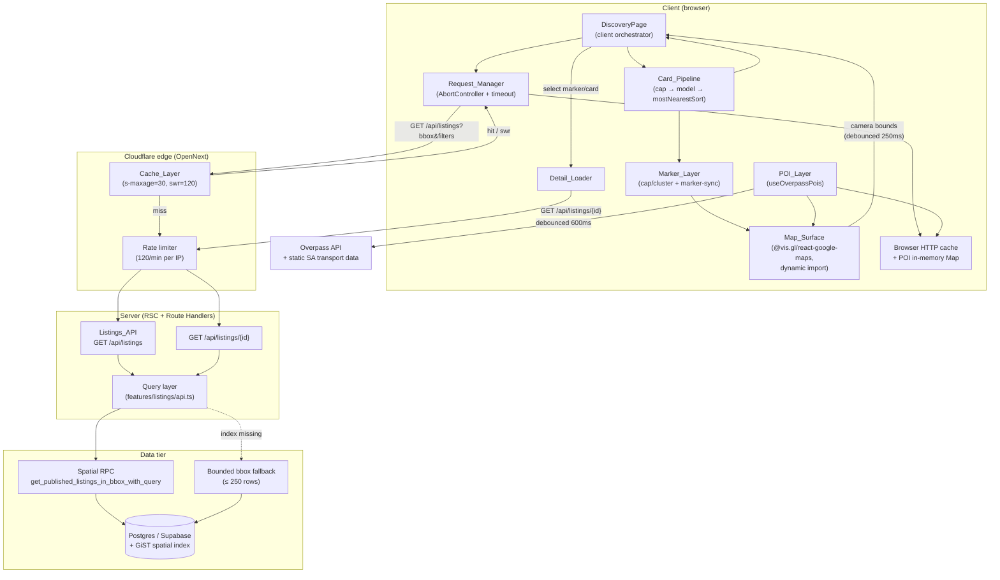
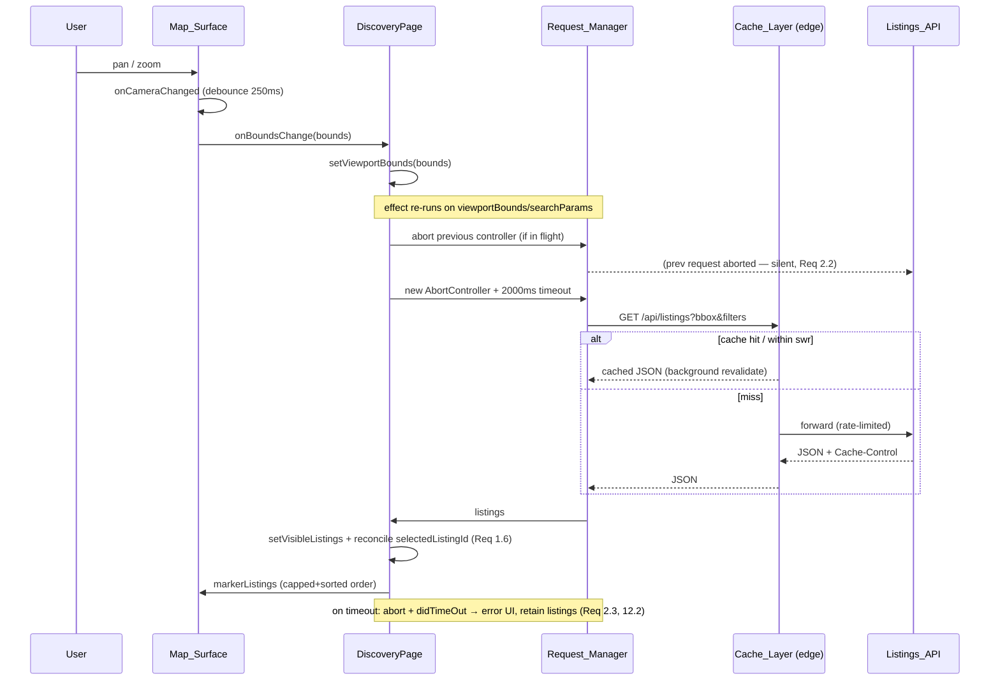
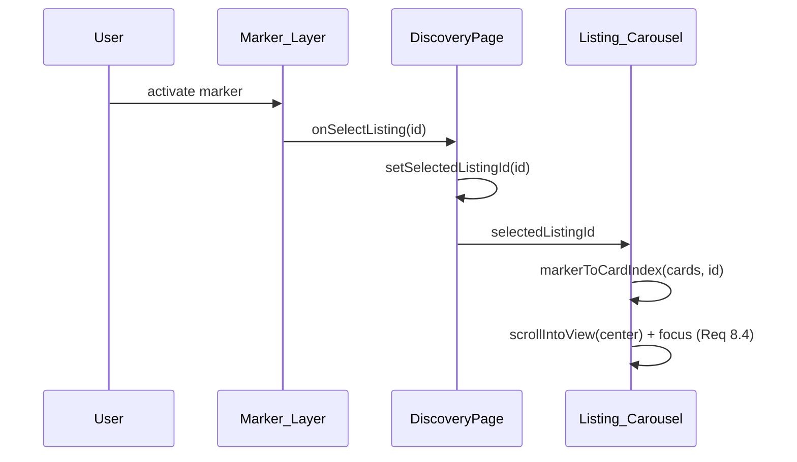
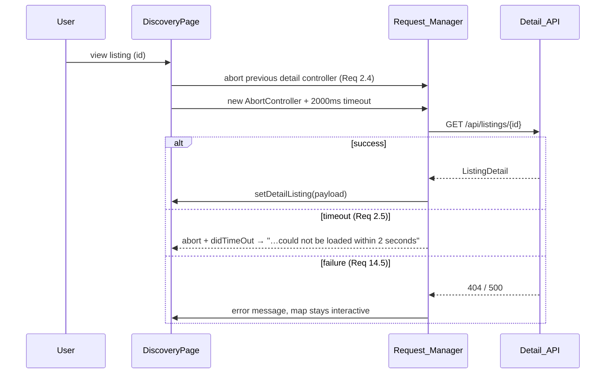

# Design Document

## Overview

The Discovery_Page_Experience is the map-based rental discovery surface rendered at the site root (`/`). This design documents the **target architecture** that satisfies every requirement (1–15) in `requirements.md`, grounded in the mature existing implementation rooted at `src/features/map-discovery/discovery-page.tsx`, its `lib/`, `hooks/`, and `mobile/` modules, the `/api/listings` and `/api/listings/{id}` route handlers, and the `src/features/listings/api.ts` query layer.

The experience is built on **Next.js App Router with React Server Components (RSC)** and deployed on **Cloudflare via OpenNext**. The design goal is to raise the surface to the ELITE PERFORMANCE & ARCHITECTURE bar: viewport-scoped data loading, aggressive request supersession and cancellation, a pure client transform pipeline for cards and markers, layered edge/CDN + in-memory caching, code-split map loading with streaming, and measurable Core Web Vitals budgets (LCP ≤ 2.5s, CLS ≤ 0.1, INP ≤ 200ms, Lighthouse ≥ 90) with 60 FPS minimum interaction (120 FPS on capable displays).

The architecture separates three concerns cleanly, which is the seam that makes the whole surface testable and fast:

1. **Server data layer** — a single indexed spatial RPC (`get_published_listings_in_bbox_with_query`) with a bounded 250-row fallback, strict `bbox` and filter validation, published-only results, rate limiting, and cache headers. Pure I/O; no view logic.
2. **Pure client transform layer** — the `lib/` modules (`cap`, `distance`, `sort`, `sheet`, `marker-sync`, `format`). Deterministic, side-effect-free functions that produce the Listing_Card_Model view models, the marker order, and the sheet geometry. This is where property-based testing concentrates.
3. **Interactive client shell** — `discovery-page.tsx` orchestrates state, the Request_Manager (AbortController-based supersession + timeout), the map (dynamically imported), the desktop grid/panel, and the mobile shell/bottom-sheet. It wires the other two layers together and owns loading/error/empty states.

### Relationship to existing specs

This spec is the system-of-record for data, behavior, and performance. It defers presentation to the two narrower specs and MUST NOT contradict them:

- **`.kiro/specs/mobile-map-discovery/`** owns the mobile layout and chrome (App_Bar, Search_Bar, Listing_Marker visuals, draggable Bottom_Sheet carousel, Sort_Label). This design references those components only as containers and defines the data they display and the performance of their animation. The shared `lib/types.ts`, `lib/cap.ts`, `lib/distance.ts`, `lib/sort.ts`, `lib/sheet.ts`, `lib/marker-sync.ts`, and `lib/format.ts` modules already carry `mobile-map-discovery` property annotations; this spec reuses them rather than redefining them.
- **`.kiro/specs/discovery-pop/`** owns first-impression presentation (Value_Proposition, Primary_Search_CTA, Discovery_Spotlight, Entrance_Animation). This design defines only the data-fetch, interactivity, and performance guarantees around those elements — notably that the Viewport_Query fires when map bounds first resolve regardless of whether the spotlight is showing (Req 15.4).

## Architecture

### System / component diagram



### Rendering strategy at a glance

| Boundary | Runtime | Rationale |
| --- | --- | --- |
| `app/page.tsx` (`Home`) | RSC + `<Suspense>` | Ships zero interactive JS for the shell; streams the fallback immediately (Req 9.3, 9.4). |
| `DiscoveryPageFallback` | RSC | Server-rendered skeleton streamed while the client tree hydrates (Req 9.2, 9.4). |
| `DiscoveryPage` | Client (`"use client"`) | Owns all interactivity, request lifecycle, and state. |
| `MapViewLoader` → `MapView` | Client, `dynamic(..., { ssr: false })` | Excludes the Google Maps library from the initial route bundle (Req 9.1). |
| `/api/listings`, `/api/listings/{id}` | Route Handlers on the edge | Validation, spatial query, caching, rate limiting (Req 3, 5, 14). |

### GStack / Next.js best practices adopted

- **App Router + RSC** (Req 9.3): the root route is a server component that renders only a `<Suspense>` boundary and the client `DiscoveryPage`. Server-eligible content stays on the server, so only interactive components ship as client JS. Justification: minimizes initial JS transfer toward the 300 KB budget (Req 9.5).
- **Streaming via `<Suspense>`** (Req 9.4): the root wraps `DiscoveryPage` in `<Suspense fallback={<DiscoveryPageFallback />}>`. The fallback is a full server-rendered chrome skeleton, so the first paint is instant and does not block on client hydration or listing data. Justification: strong LCP and perceived performance.
- **`next/dynamic` with `ssr: false`** for the map (Req 9.1): `@vis.gl/react-google-maps` and the Google Maps JS SDK are heavy and browser-only. Dynamic import keeps them out of the initial bundle and shows `MapViewLoading` while they arrive (Req 9.2). Justification: the map library is the single largest dependency and is irrelevant to first paint.
- **Edge runtime + `Cache-Control` with `stale-while-revalidate`** (Req 5.1–5.3): the Listings_API response is cacheable at the Cloudflare edge with `s-maxage=30, stale-while-revalidate=120`. Justification: repeat viewports resolve at the edge without hitting the origin, and revalidation never blocks the response.
- **`next/image` with AVIF/WebP + explicit dimensions** (Req 11.5, 12.6): listing imagery uses `next/image` with `fill`/`sizes`, reserving layout space to protect CLS.
- **Router prefetch** (Req 5.5): `router.prefetch("/listings")` and `router.prefetch("/saved")` run once per mount to warm likely next navigations.

### Request lifecycle (Request_Manager)

Two independent `AbortController` refs are held in `discovery-page.tsx`: `listingRequestRef` (Viewport_Query) and `detailRequestRef` (Detail_Loader). The lifecycle rules are:

- **Supersession**: before issuing a new request the manager calls `.abort()` on the previous controller of the same kind (Req 2.1, 2.4).
- **Timeout**: each request arms a 2000 ms timer that aborts the controller and sets a `didTimeOut` flag (Req 2.3, 2.5).
- **Silent vs surfaced abort**: an `AbortError` with `didTimeOut === false` is a supersession and is swallowed (no error UI, Req 2.2). An `AbortError` with `didTimeOut === true`, or any non-abort rejection, surfaces an error indication while retaining the previously displayed listings (Req 2.3, 12.2, 12.3).
- **Unmount**: a cleanup effect aborts both controllers on unmount (Req 2.6).

## Components and Interfaces

### Server components

#### `app/page.tsx` — `Home` (RSC)
Renders `<Suspense fallback={<DiscoveryPageFallback />}><DiscoveryPage googleMapsApiKey={…} /></Suspense>`. Provides page metadata. No client JS beyond what `DiscoveryPage` pulls in. Satisfies Req 9.3, 9.4, 15.1 (root path, no separate route).

#### `Listings_API` — `GET /api/listings` (Route Handler)
Responsibilities: rate limit (120/min per client IP), validate query with Zod, parse and range-check `bbox`, invoke the query layer, and return a cached success payload or a typed failure.

```typescript
// Query schema (src/app/api/listings/route.ts)
const listingsQuerySchema = z.object({
  bbox: z.string().min(1),
  q: z.string().trim().min(1).max(120).optional(),
  minPrice: z.coerce.number().int().min(0).optional(),
  maxPrice: z.coerce.number().int().min(0).optional(),
  beds: z.coerce.number().int().min(0).optional(),
  baths: z.coerce.number().min(0).optional(),
  type: z.string().trim().min(1).max(50).optional(),
});

// Success envelope (src/lib/api.ts)
type ApiSuccess<T> = { ok: true; data: T; requestId?: string };
type ApiFailure = { ok: false; error: { code: ApiErrorCode; message: string; details?: unknown }; requestId?: string };
```

Response headers on success: `Cache-Control: public, max-age=0, s-maxage=30, stale-while-revalidate=120` (Req 5.1). On rate limit: `Retry-After`, `X-RateLimit-Limit`, `X-RateLimit-Remaining` (Req 14.1, 14.2).

#### `Detail_API` — `GET /api/listings/{id}` (Route Handler)
Rate-limited (120/min per IP), validates `id` as a UUID (Zod), returns the full detail payload via `getPublishedListingApiPayload`, or `404` when the listing is absent/unpublished. Logs a correlation `requestId` when images fail to load.

#### Query layer — `src/features/listings/api.ts`
- `parseBbox(value)` — splits on commas, coerces to numbers, and validates: exactly 4 finite parts (else 400), longitude in [-180, 180], latitude in [-90, 90] (Req 3.3, 3.4).
- `getListingsInViewport(bbox, filters)` — calls the single spatial RPC `get_published_listings_in_bbox_with_query` (Req 3.1). On a missing-spatial-index error (`isMissingSpatialIndexError`), falls back to `getListingsInViewportFallback` (Req 3.2). On any other error, returns `{ error }` → 500 (Req 3.6).
- `getListingsInViewportFallback(...)` — a bounded `listings` table query constrained to the bbox, `status = 'published'`, ordered by `created_at desc`, filtered in-process, and `.slice(0, 250)` (Req 3.2, 3.5). Returns `{ listings, missingSpatialIndex: true }` so the route can log the fallback path.
- `mapListingRow(row)` — projects a DB row to the minimal viewport view model (identifier, title, area, price, lat, lng, bedrooms, bathrooms, imageUrls, availabilityDate, created_at) and always returns `imageUrls: []` when there is no image (Req 4.1, 4.5).
- `getPublishedListingApiPayload(id)` — the full detail payload including images (Req 4.4).

### Client components

#### `DiscoveryPage` (`discovery-page.tsx`)
The orchestrator. Owns: `visibleListings`, `selectedListingId`, `viewportBounds`, `searchQuery`, `filters`, `isLoadingListings`, `listingError`, `detailListing`, `isLoadingDetail`, `geoOrigin`, `sheetSnap`, view/sort UI state, and the two AbortController refs. Derives `cards`, `markerListings`, `sortedVisibleListings`, and `distanceOrigin` via memoized selectors. Wires filters ↔ URL (Req 6.1–6.3), prefetches routes (Req 5.5), auto-opens a `listingId` deep link once (Req 13.4), and restores/persists the sheet snap (Req 13.1–13.3).

#### `MapViewLoader` / `MapView`
`MapViewLoader` dynamically imports `MapView` with `ssr: false` and a `MapViewLoading` fallback (Req 9.1, 9.2). `MapView` renders the Google Map, reports debounced camera bounds (250 ms) via `onBoundsChange` (Req 1.2), renders markers or clusters, POI markers, the selected-listing circle, and the desktop InfoWindow. Key prop shape:

```typescript
export type MapViewProps = {
  apiKey?: string;
  listings: ListingPin[];
  selectedListingId?: string;
  onSelectListing?: (listingId: string) => void;
  onViewListing?: (listingId: string) => void;
  onBoundsChange?: (bounds: ViewportBounds) => void;
  initialCenter?: { lat: number; lng: number };
  poiMarkers?: POIMarkerData[];
  detailOpen?: boolean;
};
```

#### Card_Pipeline (pure `lib/` modules)
- `capListings<T>(items): T[]` — returns the first `min(len, MAX_MARKERS=200)` items in input order (Req 7.1, 8.1).
- `haversineKm(a, b): number` — great-circle distance in km; symmetric, identity-at-zero (Req 7.2).
- `mostNearestSort(cards): ListingCardModel[]` — ascending `distanceKm`, stable on ties, nulls last (Req 7.6).
- `clusterMarkers` / `shouldClusterMarkers` — cluster when count > `MARKER_CLUSTER_THRESHOLD=200` (Req 8.2, 8.3).
- `markerToCardIndex(cards, id): number` — first index whose `card.id === id`, else -1 (Req 8.4).

#### Sheet math (pure `lib/sheet.ts`)
`clampSheetHeight`, `snapHeights`, `nearestSnap`, `resolveSheetRelease`, `stepSnap` — the three-snap (collapsed/half/expanded) geometry and velocity-projected magnetic release used by the Bottom_Sheet (Req 10.4, 13.1). Presentation is owned by `mobile-map-discovery`; this spec owns the math and its invariants.

#### `useOverpassPois(activeCategoryIds, bounds)` (POI_Layer)
Debounces amenity fetches by 600 ms, aborts superseded requests, and caches results in a module-level `Map` keyed by `categoryId + bounds rounded to 0.01°` (precision `100`) (Req 5.4, 14.4). Degrades silently on failure/abort, leaving listing markers and cards intact (Req 14.3).

## Data Models

### Viewport listing view model (server → client)
Returned by `Listings_API`; the minimal field set consumed by cards and markers (Req 4.1).

```typescript
type ViewportListing = {
  id: string;
  title: string;
  area: string;          // DB `address`
  price: number;         // numeric source (client formats to "R …")
  latitude: number;
  longitude: number;
  bedrooms: number;
  bathrooms: number;
  imageUrls: string[];   // [] when no image (Req 4.5)
  availabilityDate: string | null;
  created_at: string | null;
};

type ViewportListingResponse = {
  ok: true;
  data: { listings: ViewportListing[] };
  requestId?: string;
};
```

### Client-internal listing model
`discovery-page.tsx` maps `ViewportListing → Listing` via `toListing`, adding formatted `price`/`fullPrice` and a numeric `priceValue` (source for sort and card model).

### Listing_Card_Model (`lib/types.ts`)
The view model consumed by `ListingCard`/`ListingCarousel`.

```typescript
type ListingCardModel = {
  id: string;
  title: string;
  imageUrls: string[];
  price: number;
  bedrooms: number;
  bathrooms: number;
  rating: number | null;       // undeterminable today → null
  reviewCount: number | null;  // undeterminable today → null
  distanceKm: number | null;   // haversine from Distance_Origin; null when origin undeterminable
  agent?: { id: string; name: string; avatarUrl?: string; isVerified?: boolean } | null;
};
```

### Detail model (`ListingDetail`)
The full payload for the detail panel: pricing/utility estimates, parking, amenities metadata, and an ordered `images: ListingImage[]` array (Req 4.4). Returned by `GET /api/listings/{id}`.

### Supporting types

```typescript
type ViewportBounds = { west: number; south: number; east: number; north: number };
type GeoPoint = { lat: number; lng: number };
type SheetSnap = "collapsed" | "half" | "expanded";
type POIMarkerData = { id: string; name: string; lat: number; lng: number; category: LayerCategory };
```

### Request / response schemas
- **Viewport request**: `GET /api/listings?bbox=west,south,east,north&q&minPrice&maxPrice&beds&baths&type`. `bbox` coordinates are formatted with `toFixed(6)` (6 decimal places) on the client (Req 1.1). Filters mirror the URL query string (Req 1.5, 6.1–6.3).
- **Detail request**: `GET /api/listings/{uuid}`.
- **Success**: `{ ok: true, data, requestId }`. **Failure**: `{ ok: false, error: { code, message, details? }, requestId }` with HTTP 400 / 404 / 429 / 500.

### Cache keys
- **Edge/CDN**: keyed by the full request URL (bbox + filters). TTL governed by `s-maxage=30`, `stale-while-revalidate=120` (Req 5.1–5.3).
- **POI in-memory**: `${categoryId}_${north}_${south}_${east}_${west}` with each coordinate rounded to 0.01° (`Math.round(coord * 100) / 100`) (Req 5.4).
- **Map tile cache**: managed by the Google Maps SDK; tiles for a previously viewed bounds render without a new tile request (Req 5.6).

## Data Flow Sequences

### 1. Viewport pan → debounce → query → render (with supersession/cancellation)



### 2. Marker / card selection



### 3. Detail load



## Performance & Rendering Strategy

- **RSC vs client boundaries** (Req 9.3): the root and fallback are server components; only `DiscoveryPage` and its interactive children are client components. This keeps server-only work off the client bundle.
- **Dynamic map import** (Req 9.1, 9.2): the Google Maps SDK loads via `next/dynamic({ ssr: false })` with a `MapViewLoading` placeholder, keeping it out of the initial route JS.
- **Streaming** (Req 9.4): `<Suspense>` streams the `DiscoveryPageFallback` chrome immediately; listing data arrives after hydration via the client fetch, never blocking first paint.
- **Memoization** (Req 10.1, 10.6): `cards`, `markerListings`, `sortedVisibleListings`, and `distanceOrigin` are `useMemo`-derived so pan/zoom re-renders do not recompute the pipeline unless inputs change. Callbacks are `useCallback`-stable to avoid re-subscribing children.
- **Marker clustering / virtualization** (Req 8.2, 8.3): at ≤ 200 in-view markers each listing renders one `AdvancedMarker`; above 200 the `clusterMarkers` grid bucketing collapses pins into cluster badges, bounding the DOM node count and keeping pan/zoom within the Frame_Budget.
- **Frame-budget approach** (Req 10.1–10.4): camera events are debounced (250 ms) so queries never fire mid-gesture; the Bottom_Sheet drag updates a single `height` style per pointer move (driven by `clampSheetHeight`) and uses `willChange: height` with a transform-based keyboard offset, targeting one update per animation frame (16.7 ms @ 60 FPS, 8.3 ms @ 120 FPS).
- **GPU-accelerated animation** (Req 10.3, 10.5): entrance/settle motion uses `transform`/`opacity` only (`discovery-card-reveal`), and `prefers-reduced-motion: reduce` collapses motion to final state via a global CSS safeguard.
- **Image optimization** (Req 11.5, 12.6): `next/image` serves AVIF/WebP with explicit `fill` + `sizes`, reserving layout box to protect CLS; failed images fall back to a placeholder.
- **Budgets**: initial client JS for `/` ≤ 300 KB compressed (Req 9.5); viewport response ≤ 150 KB compressed at the 200-listing cap (Req 4.3), supported by minimal field selection (Req 4.1) and `Accept-Encoding` compression (Req 4.2).
- **Core Web Vitals** (Req 11.1–11.4): LCP ≤ 2.5s (streamed chrome + deferred map), CLS ≤ 0.1 (reserved image/map boxes), INP ≤ 200ms (debounce + memoization + abort), Lighthouse ≥ 90 on a mid-tier mobile profile.

## Caching Strategy

- **Edge/CDN** (Req 5.1–5.3): successful viewport responses carry `public, max-age=0, s-maxage=30, stale-while-revalidate=120`. Within 0–30s a cached response is fresh; from 30–120s it is served stale immediately while a background revalidation refreshes the entry; a failed revalidation keeps serving the stale copy until 120s elapses.
- **POI in-memory** (Req 5.4): `useOverpassPois` holds a module-level `Map` keyed by layer id + bounds rounded to 0.01°, returning cached amenities without a new Overpass request on a key hit.
- **Route prefetch** (Req 5.5): `router.prefetch("/listings")` and `router.prefetch("/saved")` run exactly once per mount.
- **Map tile cache** (Req 5.6): tiles already in the Google Maps SDK cache render without new tile requests.
- **Browser HTTP cache**: `GET` requests to the Listings_API are cacheable by the browser per the same headers, complementing the edge cache for repeat viewports.

## Server / Geospatial Design

- **Single spatial RPC** (Req 3.1): `get_published_listings_in_bbox_with_query` returns all card/marker fields in one query — no per-listing N+1.
- **Bounded fallback** (Req 3.2): when the RPC reports a missing spatial index (matched by `isMissingSpatialIndexError`), a lat/lng-bounded query on `listings` runs, filters in-process, and is capped to 250 rows; the route logs that the fallback path was used.
- **Validation** (Req 3.3, 3.4): Zod validates the query shape; `parseBbox` enforces four finite comma-separated numbers and coordinate ranges, returning 400 on failure.
- **Published-only** (Req 3.5): both the RPC and fallback constrain to `status = 'published'`.
- **Server errors** (Req 3.6): non-index query failures return HTTP 500 with a correlation `requestId` (via `getRequestId`) and a logged error.
- **Rate limiting** (Req 14.1, 14.2): `consumeRateLimit` (Upstash sliding window) enforces 120 requests/min per client IP on both routes, returning 429 with `Retry-After` and `X-RateLimit-*` headers.

## Correctness Properties

*A property is a characteristic or behavior that should hold true across all valid executions of a system — essentially, a formal statement about what the system should do. Properties serve as the bridge between human-readable specifications and machine-verifiable correctness guarantees.*

The pure transform layer (`lib/cap`, `lib/distance`, `lib/sort`, `lib/sheet`, `lib/marker-sync`, `lib/format`) is the natural home for property-based testing: these are deterministic, side-effect-free functions with large input spaces and clear invariants. The project already tests them with `vitest` + `fast-check`. The properties below are written for this spec's acceptance criteria; several reuse or extend properties already annotated for `mobile-map-discovery`.

### Property 1: Marker cap preserves a bounded in-order prefix

*For any* array of listings, `capListings` returns the first `min(length, 200)` elements in their original input order, and its length never exceeds 200.

**Validates: Requirements 7.1, 8.1**

### Property 2: Distance is a symmetric, zero-identity metric

*For any* two geographic points `a` and `b`, `haversineKm(a, b) === haversineKm(b, a)`, and `haversineKm(a, a) === 0`.

**Validates: Requirements 7.2**

### Property 3: "Most Nearest" ordering is ascending, stable, and null-last

*For any* list of Listing_Card_Models, `mostNearestSort` returns a permutation in which every determinable `distanceKm` is ≤ the next, models with equal distance preserve their relative input order, and every model with `distanceKm === null` appears after all models with a determinable distance.

**Validates: Requirements 7.6, 6.6, 15.5**

### Property 4: Distance origin resolution precedence

*For any* combination of visitor geolocation and Viewport_Bounds, the resolved Distance_Origin equals the geolocation when present; otherwise the midpoint of the Viewport_Bounds when bounds exist; otherwise null (in which case every card's `distanceKm` is null).

**Validates: Requirements 7.3, 7.4, 7.5**

### Property 5: Price sort ordering is monotonic

*For any* list of listings, sorting by "Price: Low to High" yields non-decreasing `priceValue`, and sorting by "Price: High to Low" yields non-increasing `priceValue`.

**Validates: Requirements 6.4, 6.5**

### Property 6: Latest sort orders by descending creation timestamp

*For any* list of listings, sorting by "Latest" orders them so each listing's creation timestamp is ≥ the next (missing timestamps treated as epoch and ordered last).

**Validates: Requirements 6.7**

### Property 7: Marker order matches card order

*For any* set of visible listings, the derived `markerListings` sequence contains the same ids in the same order as the Card_Pipeline output, so marker index aligns with card index.

**Validates: Requirements 8.1**

### Property 8: Marker-to-card resolution

*For any* list of cards and any id, `markerToCardIndex` returns the first index whose `card.id === id`, or -1 when no card matches.

**Validates: Requirements 8.4**

### Property 9: Clustering threshold behavior

*For any* set of markers, `shouldClusterMarkers` is true exactly when the count exceeds 200; at or below 200 each listing yields one individual marker, and above 200 the output is spatial clusters whose member counts sum to the input count.

**Validates: Requirements 8.2, 8.3**

### Property 10: Sheet height clamps within bounds and resolves to a valid snap

*For any* candidate height, viewport height, and fling velocity, `clampSheetHeight` returns a value within `[collapsed, expanded]`, and `resolveSheetRelease` returns exactly one of the three snap positions — the one nearest the velocity-projected release height.

**Validates: Requirements 10.4, 13.1**

### Property 11: bbox validation accepts only four finite in-range coordinates

*For any* candidate `bbox` string, `parseBbox` returns a parsed bbox if and only if the string is four comma-separated finite numbers with longitude in [-180, 180] and latitude in [-90, 90]; otherwise it returns a validation error.

**Validates: Requirements 3.3, 3.4**

### Property 12: POI cache key rounds bounds to 0.01° precision

*For any* two Viewport_Bounds whose coordinates agree to 0.01° for a given layer, `getCacheKey` produces identical keys (so the second lookup hits the in-memory cache); bounds differing by more than 0.01° produce distinct keys.

**Validates: Requirements 5.4**

### Property 13: bbox request formatting uses six decimal places

*For any* Viewport_Bounds, the `bbox` request parameter is the four coordinates `west,south,east,north` each formatted to exactly six decimal places.

**Validates: Requirements 1.1**

## Error Handling

- **Loading** (Req 12.1): while a Viewport_Query is in flight, `isLoadingListings` drives skeleton/spinner indications in the carousel, grid, and panel.
- **Retain-previous-on-failure** (Req 12.2): both timeout and non-abort failures leave `visibleListings` untouched, so the last good results stay on screen until a subsequent query succeeds.
- **Error + retry** (Req 12.3, 12.4): a failed/timed-out load sets `listingError`, rendering an error indication with a Retry control; retry re-runs the query for the current bounds (via a fresh `viewportBounds` object copy) and shows the loading indication again.
- **Empty state** (Req 12.5): zero listings after a successful, error-free load renders `EmptyStateCapture`, prompting exploration or joining the area waitlist.
- **Supersession-silent vs timeout-error** (Req 2.2, 2.3): an `AbortError` without `didTimeOut` is swallowed; a timeout abort or any other rejection surfaces an error.
- **Detail load failure** (Req 2.5, 14.5): a detail timeout shows "…could not be loaded within 2 seconds"; a non-supersession failure shows a generic detail error while the map stays interactive.
- **Image failure** (Req 12.6): failed listing images fall back to a placeholder image.
- **POI degradation** (Req 14.3): a failed/aborted amenity request leaves listing markers and cards intact without the overlay.
- **sessionStorage unavailable** (Req 13.3): sheet-snap read/write is wrapped in try/catch; failures fall back to the default snap silently.
- **Server errors** (Req 3.6, 14.1): 500 responses carry a correlation `requestId`; 429 responses carry `Retry-After` and `X-RateLimit-*` headers.

## Testing Strategy

Property-based testing **is** appropriate here because the transform layer is pure with large input spaces and clear invariants. The server route, caching, and rate limiting are I/O and infrastructure and are covered by integration/example tests, not PBT.

### Property-based tests (pure `lib/` modules)
- **Library**: `fast-check` with `vitest` (already in use across `src/features/map-discovery/lib/*.test.ts`). Do not hand-roll PBT.
- **Iterations**: each property test runs a minimum of 100 generated cases.
- **Tagging**: each test references its design property with a comment in the form `Feature: discovery-page-experience, Property {number}: {property_text}`.
- **Coverage mapping**: Properties 1–3, 5, 6, 8, 9 → `cap`, `distance`, `sort`, `marker-sync` tests; Property 10 → `sheet` tests; Property 11 → a `parseBbox` unit/property test in the query layer; Properties 4, 7, 12, 13 → focused tests on the `distanceOrigin`, `markerListings`, `getCacheKey`, and bbox-formatting logic (extracting the bbox formatter and origin resolver into pure helpers to make them directly testable).

### Unit / example tests
- `parseBbox` edge cases: missing param, wrong arity, non-finite, out-of-range lat/lng (Req 3.3, 3.4).
- `toListing` / `mapListingRow` field projection, including empty `imageUrls` when no image (Req 4.1, 4.5).
- Sort selectors for each Sort_Order option (Req 6.4–6.7).
- Request_Manager behavior: supersession is silent, timeout surfaces an error, unmount aborts (Req 2.2, 2.3, 2.6) — exercised via mocked `fetch`/`AbortController`.

### Integration tests (API route)
- Validation: 400 on bad `bbox`; 404 on unknown detail id (Req 3.3, 3.4).
- Caching: success response carries the exact `Cache-Control` header (Req 5.1).
- Rate limiting: the 121st request in a window returns 429 with `Retry-After` and `X-RateLimit-*` (Req 14.1, 14.2).
- Fallback path: a simulated missing-index error routes to the 250-row fallback and logs it (Req 3.2).

### Performance / CWV verification
- **Lab**: Lighthouse CI on a mid-tier mobile profile targeting Performance ≥ 90, LCP ≤ 2.5s, CLS ≤ 0.1 (Req 11.1, 11.2, 11.4).
- **Bundle budgets**: a size check asserts the `/` route initial client JS ≤ 300 KB compressed (Req 9.5) and the viewport payload ≤ 150 KB compressed at the 200-listing cap (Req 4.3).
- **Interaction**: INP field/lab measurement ≤ 200ms (Req 11.3); frame-rate profiling of pan/zoom and sheet drag against the 16.7 ms / 8.3 ms Frame_Budgets (Req 10.1, 10.2). These are measured, not asserted as property tests, because they depend on hardware and rendering rather than pure input/output.

## Requirements Traceability

| Requirement | Design element(s) that satisfy it |
| --- | --- |
| 1. Viewport-based loading | Request_Manager effect on `viewportBounds`/`searchParams`; 6-dp bbox formatting; 250 ms camera debounce in `MapView`; selected-listing reconciliation (Property 13; Sequence 1) |
| 2. Request lifecycle | Two AbortController refs, 2000 ms timeouts, `didTimeOut` flag, unmount cleanup (Request_Manager; Sequences 1 & 3) |
| 3. Geospatial queries | Single spatial RPC + bounded 250-row fallback; `parseBbox` validation; published-only; 500 + requestId (Query layer; Property 11) |
| 4. Minimal payloads | `mapListingRow` field selection; `Accept-Encoding` compression; 150 KB budget; empty `imageUrls`; full detail payload (Data Models; Performance) |
| 5. Layered caching | `Cache-Control` s-maxage=30/swr=120; POI in-memory 0.01° cache; route prefetch; tile cache (Caching Strategy; Property 12) |
| 6. Filtering & sorting | Filters ↔ URL sync; price/latest/closest sort selectors (Card_Pipeline; Properties 3, 5, 6) |
| 7. Card pipeline & origin | `capListings` → model → `mostNearestSort`; `haversineKm`; origin precedence (Properties 1–4) |
| 8. Marker layer | `markerListings` derived from card order; clustering > 200; marker activation; in-bounds markers (Properties 7, 8, 9) |
| 9. Rendering & code split | RSC root; `dynamic({ ssr: false })` map + loader; `<Suspense>` streaming; 300 KB budget (Rendering Strategy) |
| 10. Frame rate & animation | Memoized selectors; debounced camera; single-frame sheet drag via `clampSheetHeight`; transform/opacity motion; reduced-motion (Performance; Property 10) |
| 11. Core Web Vitals | Streamed chrome, deferred map, reserved image/map boxes, AVIF/WebP; Lighthouse CI (Performance; Testing) |
| 12. Loading/error/empty | `isLoadingListings`; retain-on-failure; error + retry; `EmptyStateCapture`; image placeholder (Error Handling) |
| 13. Persistence & deep linking | Sheet-snap sessionStorage restore/persist; `listingId` auto-open once; URL-reproducible filters (Property 10; Error Handling) |
| 14. Reliability & degradation | 120/min rate limit + Retry-After/X-RateLimit; POI silent degradation + 600 ms debounce; detail failure keeps map interactive (Server Design; Error Handling) |
| 15. Consistency with existing specs | Root path only; supplies Bottom_Sheet/Carousel data; supplies value-prop/CTA data-fetch; query fires on first bounds regardless of spotlight; Closest = ascending distance (Overview; Property 3) |
