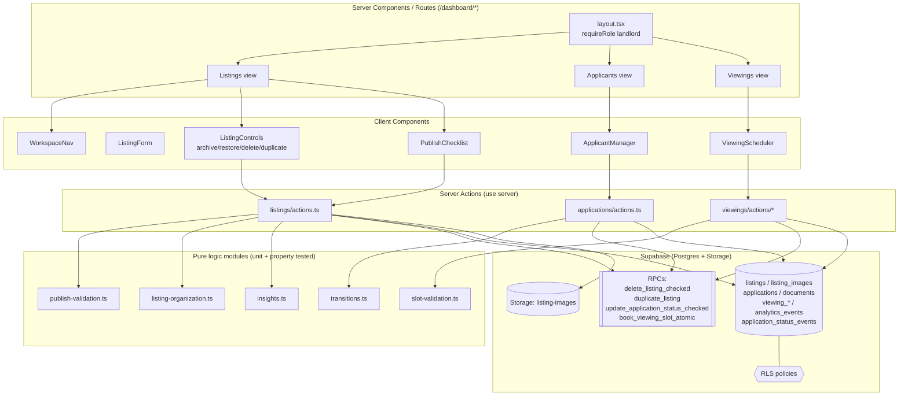

# Design Document

## Overview

This feature elevates the RoomZA Landlord experience into a first-class **Listing Workspace** rooted at `/dashboard`. It extends the existing listing lifecycle (`draft → published`) with archiving, restoration, deletion, and duplication; adds draft persistence and a publish-readiness checklist; introduces workspace navigation with search/filter/sort; surfaces per-listing performance insights; consolidates applicant management across all of a Landlord's listings; and gives Landlords control over viewing scheduling.

The design is **brownfield and additive**. It builds directly on existing primitives rather than re-implementing them:

- **Server actions** in `src/features/listings/actions.ts`, `src/features/applications/actions.ts`, and `src/features/viewings/actions/*` already cover create/update, publish/unpublish, image upload, applicant listing, status changes, and viewing proposal/booking. This feature reuses these and adds new actions for archive, restore, delete, duplicate, insights, consolidated applicants, and landlord viewing retrieval.
- The **`listing_status` enum already includes `archived`** (`supabase/migrations/20260504013500_add_listings_viewport_query.sql`), so archiving requires no enum change.
- The **`applications`, `documents`, `viewing_slots`, `viewing_slot_offers`, `viewings`, and `analytics_events` tables already exist**, with RLS policies and the atomic RPCs `submit_application_atomic`, `update_application_status_checked`, and `book_viewing_slot_atomic`. We extend these, we do not duplicate them.
- UI is composed from the existing premium primitives (`AppShell`, `PageHeader`, `EmptyState`, `MetricStrip`, `StatusBadge`, `ActionBar`) and `src/components/ui/*`.

The core strategy is to **extract pure logic modules** (publish validation, listing organization, insights aggregation, status transitions, slot validation, duplicate-title formatting) that the server actions and React components consume. This keeps the I/O thin and the business rules unit- and property-testable, and it consolidates the publish-validation logic that currently lives inline inside `publishListing` (and is partially exercised by the orphan test `src/features/listings/publish-validation.test.ts`).

### Requirements coverage map

| Requirement | Primary design sections |
|---|---|
| 1. Workspace navigation + role guards | Architecture, Components and Interfaces (Routes, `WorkspaceNav`), Security |
| 2. Creation + draft persistence + image upload | Components and Interfaces (reuse `createListing`/`updateListing`/`uploadListingImage`), Data Models |
| 3. Publish-readiness checklist | Components and Interfaces (`publish-validation` module, `getPublishReadiness`, `publishListing`) |
| 4. Archiving / restoration (atomic) | Components and Interfaces (`archiveListing`/`restoreListing`), Error Handling |
| 5. Deletion (ownership-first + active-applicant guard + atomic image removal) | Data Models (`delete_listing_checked` RPC), Components and Interfaces, Error Handling, Security || 6. Duplication | Data Models (`duplicate_listing` RPC), Components and Interfaces (`duplicateListing`, `duplicateTitle`) |
| 7. Search / filter / sort | Components and Interfaces (`listing-organization` module), Correctness Properties |
| 8. Per-listing insights | Components and Interfaces (`insights` module, `getListingInsights`), Error Handling |
| 9. Consolidated applicant management | Data Models (`application_status_events`), Components and Interfaces (`getAllApplicants`, `transitions` module), Security |
| 10. Landlord viewing scheduling | Components and Interfaces (`slot-validation` module, extended `proposeViewingSlots`, `getLandlordViewings`), Correctness Properties |

## Architecture

### Layered structure

The feature follows the existing project layering: thin server actions wrap Supabase I/O and delegate business rules to pure modules; React Server Components render workspace views; Client Components handle interaction; RLS plus server-side ownership checks enforce access control; atomic invariants that span multiple rows are enforced in `SECURITY`-scoped Postgres RPCs.



### Data flow examples

- **Render Listings view**: `layout.tsx` runs `requireRole("landlord")`; the Listings RSC calls `getMyListings()` (which already joins `listing_images` and `applications`), then applies the pure `organizeListings()` with search/filter/sort params parsed from the URL query string, and renders cards plus per-card publish-readiness and insights summaries.
- **Delete a listing**: `ListingControls` confirms intent client-side, calls `deleteListing(id)`; the action gathers image storage paths via an RLS-scoped select, invokes the `delete_listing_checked` RPC (ownership + active-applicant guard + transactional row delete), then removes storage objects and revalidates.
- **Propose viewing slots**: `ViewingScheduler` calls the extended `proposeViewingSlots(payload)`; the action validates each slot with the pure `validateViewingSlot(slot, now)` before any DB write, enforces listing ownership, then inserts slots and offers.

### Workspace routing

Navigation is implemented with a shared `src/app/dashboard/layout.tsx` Server Component that performs the role guard once for every workspace route and renders the persistent `WorkspaceNav`. Three sibling routes provide the three views:

- `/dashboard` — Listings view (default active entry, Requirement 1.7)
- `/dashboard/applicants` — consolidated Applicants view
- `/dashboard/viewings` — Viewings view

The archived listings sub-view is a query-parameterized state of the Listings view (`/dashboard?status=archived`) rather than a separate route, so the search/filter/sort controls and the status filter share one surface (Requirements 4.4, 4.5, 7.2).

## Data Models

The guiding principle is **reuse the existing schema**. Listing lifecycle states already exist in the `listing_status` enum; application statuses, viewing tables, and storage buckets are all in place. Only three additive changes are required, delivered in a single new migration (`supabase/migrations/<timestamp>_landlord_listing_management.sql`). No existing column, enum value, or policy is dropped or repurposed.

### Existing tables reused unchanged

- `public.listings` — lifecycle via `status public.listing_status` (`draft | published | archived`), owned by `landlord_id`. Archive/restore/duplicate all operate on `status` and existing columns.
- `public.listing_images` — `unique (listing_id, sort_order)`; `path`/`public_url` reference the public `listing-images` storage bucket. `ON DELETE CASCADE` from `listings`.
- `public.applications` — `status public.application_status` (`submitted | under_review | shortlisted | rejected | approved | withdrawn`); `ON DELETE CASCADE` from `listings`.
- `public.viewing_slots`, `public.viewing_slot_offers`, `public.viewings` — with `viewing_status` (`booked | cancelled | completed`), the `check_end_after_start` CHECK constraint, `unique_viewing_slot`, and the atomic `book_viewing_slot_atomic` RPC.
- `public.analytics_events` — reused as the audit sink for unauthorized access attempts (Requirement 9.6) via `event_name = 'unauthorized_application_access'`.

### Change 1: `application_status_events` audit table (Requirement 9.5)

Requirement 9.5 requires recording each Landlord-initiated status change with its time, previous status, and new status so the Renter can be notified. This is captured in a new append-only table written **inside the same transaction** as the status update.

```sql
create table public.application_status_events (
  id uuid primary key default gen_random_uuid(),
  application_id uuid not null references public.applications(id) on delete cascade,
  changed_by uuid not null references public.profiles(id) on delete cascade,
  previous_status public.application_status not null,
  new_status public.application_status not null,
  created_at timestamptz not null default now()
);

create index application_status_events_application_id_idx
  on public.application_status_events(application_id);

alter table public.application_status_events enable row level security;

-- Landlords can read history for applications to listings they own.
create policy "Landlords read status history for their listings"
  on public.application_status_events for select to authenticated
  using (
    exists (
      select 1 from public.applications a
      join public.listings l on l.id = a.listing_id
      where a.id = application_id and l.landlord_id = (select auth.uid())
    )
  );

-- Renters can read history for their own applications (for notifications).
create policy "Renters read status history for their applications"
  on public.application_status_events for select to authenticated
  using (
    exists (
      select 1 from public.applications a
      where a.id = application_id and a.renter_id = (select auth.uid())
    )
  );
```

Inserts happen only through the RPC below (no direct insert policy), keeping the audit trail authoritative.

### Change 2: extend `update_application_status_checked` RPC (Requirements 9.3, 9.4, 9.5)

The existing transition-checking RPC is extended to (a) capture the previous status and (b) insert an `application_status_events` row in the same transaction as the `UPDATE`. The transition rules themselves are unchanged (terminal = `withdrawn | rejected | approved`; permitted transitions from `submitted`, `under_review`, `shortlisted`). The function continues to return `('updated' | 'not_found' | 'terminal_status' | 'invalid_transition')`.

```sql
-- inside update_application_status_checked, after the transition checks pass:
update public.applications
  set status = target_status, updated_at = now()
  where id = target_application_id;

insert into public.application_status_events (application_id, changed_by, previous_status, new_status)
values (target_application_id, auth.uid(), current_status, target_status);

return query select target_application_id, 'updated'::text;
```

A new `application_status_changed` value is added to the `notification_type` enum (additive) so the action can enqueue a Renter notification through the existing `notification_events` outbox pattern.

### Change 3: `delete_listing_checked` RPC (Requirement 5)

Deletion must evaluate ownership before any other condition, reject when active applications exist, and atomically remove the listing and its images. The DB-side delete (listing row + cascaded `listing_images`, `applications`, `viewings` rows) is performed transactionally in this RPC; storage object removal is performed by the calling action immediately afterward (see Error Handling for the atomicity rationale and reconciliation).

```sql
create or replace function public.delete_listing_checked(target_listing_id uuid)
returns table(result text)
language plpgsql
security invoker
set search_path = public
as $$
declare
  owner uuid;
  active_count integer;
begin
  select landlord_id into owner
  from public.listings
  where id = target_listing_id
  for update;

  -- Ownership evaluated FIRST (Req 5.5): unknown listing or non-owner => access_denied.
  if owner is null or owner <> auth.uid() then
    return query select 'access_denied'::text;
    return;
  end if;

  select count(*) into active_count
  from public.applications
  where listing_id = target_listing_id
    and status in ('submitted', 'under_review', 'shortlisted', 'approved');

  if active_count > 0 then
    return query select 'has_active_applicants'::text;
    return;
  end if;

  delete from public.listings where id = target_listing_id;  -- cascades images/applications/viewings rows
  return query select 'deleted'::text;
end;
$$;

revoke all on function public.delete_listing_checked(uuid) from public, anon;
grant execute on function public.delete_listing_checked(uuid) to authenticated;
```

### Change 4: `duplicate_listing` RPC (Requirement 6)

Duplication copies the source listing's fields and amenity metadata into a new `draft` owned by the requester, with a copy-indicated title, and **zero** applications/viewings (the new row simply has no child rows). Image **storage** copying and `listing_images` row creation are performed by the action after the RPC returns the new id and the source image paths. Ownership is evaluated first.

```sql
create or replace function public.duplicate_listing(source_listing_id uuid)
returns table(result text, new_listing_id uuid)
language plpgsql
security invoker
set search_path = public
as $$
declare
  src public.listings%rowtype;
  new_id uuid;
begin
  select * into src from public.listings where id = source_listing_id;

  if src.id is null or src.landlord_id <> auth.uid() then  -- ownership first (Req 6.5)
    return query select 'access_denied'::text, null::uuid;
    return;
  end if;

  insert into public.listings (
    landlord_id, title, description, property_type, price, address, latitude, longitude,
    bedrooms, bathrooms, parking_type, parking_count, electricity_type, water_availability,
    electricity_included, electricity_estimate, water_included, water_estimate,
    wifi_available, wifi_included, wifi_estimate, parking_included, parking_estimate,
    security_fee_estimate, lease_duration, availability_date, metadata, status
  )
  select
    src.landlord_id, src.title || ' (Copy)', src.description, src.property_type, src.price, src.address,
    src.latitude, src.longitude, src.bedrooms, src.bathrooms, src.parking_type, src.parking_count,
    src.electricity_type, src.water_availability, src.electricity_included, src.electricity_estimate,
    src.water_included, src.water_estimate, src.wifi_available, src.wifi_included, src.wifi_estimate,
    src.parking_included, src.parking_estimate, src.security_fee_estimate, src.lease_duration,
    src.availability_date, src.metadata, 'draft'
  returning id into new_id;

  return query select 'duplicated'::text, new_id;
end;
$$;

revoke all on function public.duplicate_listing(uuid) from public, anon;
grant execute on function public.duplicate_listing(uuid) to authenticated;
```

The canonical copy-indicator title (`"<title> (Copy)"`) is also expressed as a pure TS helper `duplicateTitle()` so the UI can preview it and the property tests can verify the invariant; the SQL and TS implementations use the identical suffix.

### Archiving and restoration: no schema change

Archive (Requirement 4.1–4.3) and restore (Requirement 4.6) are single-row `UPDATE`s on `listings.status`, which are inherently atomic in Postgres. Because only the status column changes, the listing record, its `listing_images`, and its `applications` are retained automatically — satisfying the atomic-retention requirement (4.3) without an RPC. The server actions perform an ownership-first guard and a current-status guard (reject already-`archived` on archive, per 4.7) before issuing the update.

## Components and Interfaces

All new server actions follow the established conventions: `"use server"` at the top of the feature file, `requireRole("landlord")` (or an explicit auth+ownership check) first, Zod validation of inputs, Supabase server client from `@/lib/supabase/server`, and `revalidatePath` after mutations. Return shapes follow the existing discriminated-union `ActionResult` pattern already used across the codebase.

### Shared result types

To unify the divergent inline result shapes, a small shared module documents the conventions; existing actions keep their current shapes for backward compatibility.

```ts
// src/features/listings/types.ts
export type Ok<T = unknown> = { success: true } & T;
export type Err = { success: false; error: string };
export type ActionResult<T = unknown> = Ok<T> | Err;
```

### Pure logic modules (new)

#### `src/features/listings/publish-validation.ts` (Requirement 3)

Consolidates the publish-readiness logic currently inlined in `publishListing`. Both the checklist UI and `publishListing` consume this single module (the existing `publish-validation.test.ts` is repointed at it).

```ts
export type ChecklistItem = { key: string; label: string; met: boolean; detail?: string };
export type PublishReadiness = {
  items: ChecklistItem[];
  outstandingCount: number;
  isPublishable: boolean;
};

// Pure: evaluates required fields (via listingSchema) + image count against MIN_LISTING_IMAGES.
export function evaluatePublishReadiness(
  listing: Record<string, unknown>,
  imageCount: number,
): PublishReadiness;

// Convenience: the outstanding items as human-readable strings (used by publishListing error list).
export function outstandingConditions(readiness: PublishReadiness): string[];
```

Each required field from `listingSchema` becomes a `ChecklistItem` keyed by field name and labeled via the existing `listingFieldLabels`; the image condition is keyed `images` and labeled with the `MIN_LISTING_IMAGES` threshold. `isPublishable` is `outstandingCount === 0`.

#### `src/features/listings/listing-organization.ts` (Requirement 7)

Pure, in-memory search/filter/sort over the Landlord's listings (the set is already fetched by `getMyListings`; organizing in memory keeps it simple and fully testable).

```ts
export type StatusFilter = "draft" | "published" | "archived" | "all";
export type SortKey = "recent" | "applicants";
export type OrganizeParams = {
  search: string;            // raw; trimmed + lowercased internally, capped to 100 chars
  status: StatusFilter;      // default "all" excludes archived unless explicitly "archived"
  sorts: SortKey[];          // most-recent-first precedence; earlier entries are tie-breakers
};
export type OrganizableListing = {
  id: string; title: string; address: string; status: string;
  updated_at: string; applicationCount: number;
};

export function organizeListings<T extends OrganizableListing>(
  listings: T[], params: OrganizeParams,
): T[];
```

Behavior: trims/lowercases the search term and matches against `title` or `address` substring (7.1, 7.8); applies the status filter cumulatively with search (7.7); the default Listings view passes `status: "all"` but the view excludes `archived` unless the explicit archived sub-view is requested (4.4, 4.5); sorts apply the most-recently-selected key as primary with prior keys as stable tie-breakers (7.5); returns `[]` (driving the empty state) when nothing matches (7.6).

#### `src/features/listings/insights.ts` (Requirement 8)

Pure aggregation from already-fetched applications and viewings into the metric shape.

```ts
export type ApplicationStatus =
  | "submitted" | "under_review" | "shortlisted" | "approved" | "rejected" | "withdrawn";
export type ListingInsights = {
  totalApplications: number;                          // non-negative integer (8.1)
  byStatus: Record<ApplicationStatus, number>;        // every status present, zero-filled (8.2, 8.4)
  upcomingViewings: number;                            // future + not cancelled (8.3)
};

export function computeInsights(
  applications: { status: ApplicationStatus }[],
  viewings: { startTime: string; status: "booked" | "cancelled" | "completed" }[],
  now: Date,
): ListingInsights;
```

`byStatus` is initialized with all six statuses at zero so absent statuses report `0` (8.2, 8.4); `totalApplications` equals the sum of `byStatus` values; `upcomingViewings` counts viewings whose slot start time is `> now` and whose status is not `cancelled` (8.3).

#### `src/features/applications/transitions.ts` (Requirements 9.3, 9.4)

Mirrors the DB transition rules as a pure TS predicate so the UI can enable/disable controls and tests can assert the rule set in isolation. The database RPC remains the authority.

```ts
export const TERMINAL: ApplicationStatus[] = ["rejected", "withdrawn", "approved"];
export function permittedTransitions(current: ApplicationStatus): ApplicationStatus[];
export function isPermittedTransition(from: ApplicationStatus, to: ApplicationStatus): boolean;
```

#### `src/features/viewings/slot-validation.ts` (Requirements 10.5, 10.8)

```ts
export type SlotInput = { startTime: string; endTime: string };
export type SlotValidation = { valid: true } | { valid: false; error: string };

// Rejects start <= now (10.5), end <= start (10.8), and unparseable datetimes.
export function validateViewingSlot(slot: SlotInput, now: Date): SlotValidation;
export function validateViewingSlots(slots: SlotInput[], now: Date): SlotValidation;
```

### Server actions — reused (no signature change)

| Action | File | Requirements |
|---|---|---|
| `createListing(formData)` | listings/actions.ts | 2.1, 2.2 |
| `updateListing(id, formData)` | listings/actions.ts | 2.2, 2.3 |
| `getMyListings()` | listings/actions.ts | 1.7, 7.* (data source) |
| `getMyListing(id)` | listings/actions.ts | ownership-scoped fetch |
| `getListingImages(id)` | listings/actions.ts | 3.1 (image count) |
| `uploadListingImage(id, formData)` | listings/actions.ts | 2.6, 2.7 |
| `deleteListingImage(imageId)` | listings/actions.ts | gallery management |
| `unpublishListing(id)` | listings/actions.ts | 3.5 |
| `getListingApplicants(id)` | applications/actions.ts | per-listing view |
| `bookViewingSlot(payload)` | viewings/actions | 10.2, 10.7 |

### Server actions — refactored

#### `publishListing(listingId)` (Requirements 3.3, 3.4, 3.6)

Refactored to delegate to `evaluatePublishReadiness`. Keeps its `{ success: true } | { success: false; errors: string[] }` shape. Ownership is checked first (the existing `.eq("landlord_id", user.id)` fetch returns "not found or access denied" — 3.6). On outstanding conditions it returns `outstandingConditions(readiness)` and leaves status at `draft` (3.4); when publishable, sets `published` (3.3).

#### `updateApplicationStatus(applicationId, newStatus)` (Requirements 9.3–9.5)

Ownership check stays first. The underlying `update_application_status_checked` RPC now also writes the `application_status_events` row; on `'updated'`, the action enqueues an `application_status_changed` notification for the Renter. Return shape unchanged.

### Server actions — new

#### Listings (`src/features/listings/actions.ts`)

```ts
// Requirement 3.1, 3.2 — readiness for checklist rendering (ownership-scoped).
export async function getPublishReadiness(listingId: string):
  Promise<ActionResult<{ readiness: PublishReadiness }>>;

// Requirement 4.1–4.3, 4.7, 4.8 — ownership first, reject already-archived, atomic single-row UPDATE.
export async function archiveListing(listingId: string): Promise<ActionResult>;

// Requirement 4.6, 4.8 — ownership first; archived -> draft.
export async function restoreListing(listingId: string): Promise<ActionResult>;

// Requirement 5 — confirmation handled in UI; ownership-first + active-applicant guard via RPC;
// atomic DB delete then storage removal.
export async function deleteListing(listingId: string): Promise<ActionResult>;

// Requirement 6 — ownership first; copies fields/amenities/images; resets applications/viewings;
// copy-indicator title. Returns the new draft id.
export async function duplicateListing(listingId: string):
  Promise<ActionResult<{ listingId: string }>>;

// Requirement 8 — ownership-scoped per-listing metrics; all-or-nothing (no partial counts).
export async function getListingInsights(listingId: string):
  Promise<ActionResult<{ insights: ListingInsights }>>;
```

`deleteListing` sequence: select image `path`s (RLS-scoped) → call `delete_listing_checked` RPC → map `access_denied`/`has_active_applicants`/`deleted` to results → on `deleted`, `supabase.storage.from("listing-images").remove(paths)` → `revalidatePath("/dashboard")` and `revalidatePath("/")`.

`duplicateListing` sequence: call `duplicate_listing` RPC → on `duplicated`, read source `listing_images`, copy each storage object (`storage.copy(srcPath, newPath)` under the owner's `{userId}/{newListingId}/...` prefix to satisfy the storage RLS folder check), insert `listing_images` rows preserving `sort_order` → revalidate.

#### Applications (`src/features/applications/actions.ts`)

```ts
// Requirement 9.1, 9.7 — applications across ALL of the landlord's listings, grouped by status,
// ordered by submission time desc within each group. Empty array => empty state.
export async function getAllApplicants():
  Promise<ActionResult<{ groups: Record<ApplicationStatus, ApplicantSummary[]> }>>;

// Requirement 9.2, 9.8 — full applicant detail + documents; retry-able error on failure.
export async function getApplicantDetail(applicationId: string):
  Promise<ActionResult<{ applicant: ApplicantDetail }>>;
```

`getAllApplicants` queries `applications` joined to owned `listings` (RLS already restricts Landlords to applications on their listings — Req 9.6), groups in memory, and orders each group by `created_at` desc.

#### Viewings (`src/features/viewings/actions/`)

```ts
// Requirement 10.3, 10.4 — landlord's proposed + booked viewings with listing + applicant context.
export async function getLandlordViewings():
  Promise<ActionResult<{ viewings: LandlordViewing[] }>>;
```

`proposeViewingSlots` (existing) is extended: before any insert it runs `validateViewingSlots(slots, new Date())`, returning a validation error if any slot has `start <= now` (10.5) or `end <= start` (10.8). Listing-ownership and application-belongs-to-listing checks are retained (10.1, 10.6). The DB `check_end_after_start` constraint remains a defense-in-depth backstop.

### React components and routes

| Route / Component | Type | Responsibility | Requirements |
|---|---|---|---|
| `src/app/dashboard/layout.tsx` | RSC | `requireRole("landlord")` once for all workspace routes; render `WorkspaceNav` | 1.1, 1.4, 1.5, 1.6 |
| `src/app/dashboard/page.tsx` | RSC | Listings view: fetch + `organizeListings`; default active entry | 1.7, 2.4, 7.* |
| `src/app/dashboard/applicants/page.tsx` | RSC | Consolidated applicants grouped by status | 9.1, 9.7 |
| `src/app/dashboard/viewings/page.tsx` | RSC | Landlord viewings list / empty state | 10.3 |
| `WorkspaceNav` | Client | Listings/Applicants/Viewings entries; active highlight via `usePathname`; keyboard-navigable | 1.1, 1.2, 1.3 |
| `ListingControls` | Client | Archive/restore/delete (confirm dialog)/duplicate per card | 4, 5, 6 |
| `ListingFilters` | Client | Search box, status filter, sort selector; writes URL query params | 7.* |
| `PublishChecklist` | Client/RSC | Renders `PublishReadiness` items + outstanding count | 3.1, 3.2 |
| `ListingInsightsPanel` | RSC | Renders `ListingInsights` (total, by-status, upcoming viewings) | 8.1–8.4 |
| `ApplicantManager` | Client | Grouped applicant lists, detail panel, status actions (gated by `permittedTransitions`), retry | 9.2–9.4, 9.8 |
| `ViewingScheduler` | Client | Slot proposal form (client-side `validateViewingSlot` preview), viewings table | 10.1, 10.5, 10.8 |

`ListingForm`, `AmenitiesPicker`, `ImageUploader`, `LocationPicker`, and `ApplicantCard` are reused as-is; `ListingControls` and `ListingInsightsPanel` are added to the Listings view cards. The `ListingFilters` control drives state through URL query parameters (`?q=&status=&sort=`) so the RSC re-renders server-side and the view is shareable/back-button friendly.

## Correctness Properties

*A property is a characteristic or behavior that should hold true across all valid executions of a system — essentially, a formal statement about what the system should do. Properties serve as the bridge between human-readable specifications and machine-verifiable correctness guarantees.*

These properties target the **pure logic modules** described in Components and Interfaces (`publish-validation.ts`, `slot-validation.ts`, `listing-organization.ts`, `insights.ts`, `transitions.ts`, plus the `validateImageUpload`, `duplicateTitle`, and `hasBlockingApplications` helpers). I/O- and infrastructure-bound criteria (RLS scoping, atomic deletes, storage, role-guard redirects, audit writes) are validated by integration and example tests instead — see Testing Strategy.

### Property 1: Publish readiness reflects field validity and image threshold

*For any* listing record and *any* non-negative image count, `evaluatePublishReadiness` marks each required-field item as met exactly when that field holds a non-empty value accepted by `listingSchema`, marks the image item as met exactly when the count is at least `MIN_LISTING_IMAGES`, and reports `outstandingCount` equal to the number of unmet items with `isPublishable` true exactly when `outstandingCount` is zero.

**Validates: Requirements 3.1, 3.2, 3.3, 3.4**

### Property 2: Image upload validation accepts exactly supported, in-size files

*For any* file MIME type and byte size, `validateImageUpload` accepts the file exactly when the type is one of JPEG/PNG/WebP and the size is at most 10 MB, and otherwise rejects it with a message that names the format condition, the size condition, or both, according to which condition(s) failed.

**Validates: Requirements 2.7**

### Property 3: Viewing slot validity requires a future, well-ordered interval

*For any* proposed slot and *any* reference time `now`, `validateViewingSlot` returns valid exactly when both endpoints parse to valid datetimes, the start time is strictly after `now`, and the end time is strictly after the start time; otherwise it returns a validation error.

**Validates: Requirements 10.5, 10.8**

### Property 4: Duplicate title preserves the source and differs from it

*For any* source listing title, `duplicateTitle(title)` returns a string that contains the full source title as a substring and is not identical to the source title.

**Validates: Requirements 6.4**

### Property 5: Listing filtering returns exactly the matching listings

*For any* set of listings and *any* search term and status filter, `organizeListings` returns exactly those listings whose trimmed, case-insensitively compared title or address contains the trimmed search term **and** that match the selected status filter (where the default filter excludes archived listings and an explicit `archived` filter yields only archived listings); a whitespace-only or empty term applies no search narrowing, and when no listing satisfies both conditions the result is empty.

**Validates: Requirements 4.4, 4.5, 7.1, 7.2, 7.6, 7.7, 7.8**

### Property 6: Listing sort honors precedence with stable tie-breakers

*For any* set of listings and *any* ordered list of sort keys, the listings returned by `organizeListings` are ordered so that the most recently selected key is non-increasing across adjacent results, and wherever adjacent results are equal under the primary key they are ordered by the next key in precedence (recency by `updated_at`, applicant count by `applicationCount`).

**Validates: Requirements 7.3, 7.4, 7.5**

### Property 7: Application insights aggregation is complete and consistent

*For any* set of applications, `computeInsights` produces a `byStatus` map containing all six application statuses, where each entry equals the number of applications with that status, `totalApplications` equals both the number of applications and the sum of the `byStatus` values, every count is a non-negative integer, and an empty application set yields zero for the total and for every status.

**Validates: Requirements 8.1, 8.2, 8.4**

### Property 8: Upcoming viewings count is future and non-cancelled

*For any* set of viewings and *any* reference time `now`, `computeInsights` reports `upcomingViewings` equal to the number of viewings whose start time is strictly after `now` and whose status is not `cancelled`.

**Validates: Requirements 8.3**

### Property 9: Application status transitions follow the permitted rule set

*For any* pair of application statuses `(from, to)`, `isPermittedTransition(from, to)` is true exactly when `to` is among the permitted transitions for `from` under the workspace rule set, and no transition is permitted from a terminal status (`rejected`, `withdrawn`, `approved`); this TS rule set matches the transitions enforced by `update_application_status_checked`.

**Validates: Requirements 9.3, 9.4**

### Property 10: Consolidated applicants group by status and order by recency

*For any* set of applications across a Landlord's listings, `groupApplicants` places each application under its current status group and orders the applications within every group by submission time from most recent to least recent.

**Validates: Requirements 9.1**

### Property 11: Amenity selections round-trip through draft persistence encoding

*For any* valid amenity selection, encoding it into the listing `metadata` JSON and then decoding it via `amenitiesSchema` yields a selection equal to the original, so a saved draft reopens with the same amenity selections.

**Validates: Requirements 2.3**

### Property 12: Invalid listing fields are rejected with per-field errors

*For any* listing payload in which one or more fields hold values rejected by `listingSchema`, parsing fails and the resulting field-error map contains an entry for each invalid field, leaving valid fields unreported.

**Validates: Requirements 2.2**

### Property 13: Active applications block deletion

*For any* multiset of application statuses associated with a listing, `hasBlockingApplications` returns true exactly when at least one status is `submitted`, `under_review`, `shortlisted`, or `approved`.

**Validates: Requirements 5.4**

## Error Handling

All actions return the discriminated-union result pattern rather than throwing across the server/client boundary; the UI renders `error` messages inline (matching `ApplicantCard`, `ListingForm`, and `UnpublishButton`). Guard precedence is uniform across every action: **authentication → ownership → state/business condition → mutation**.

### Ownership-first precedence (Requirements 4.8, 5.5, 6.5, 8.6, 10.4, 10.6)

Several requirements demand that ownership be evaluated *before* any other condition (e.g. a non-owner deleting a listing with active applicants must get `access_denied`, not `has_active_applicants`). This is enforced in two layers:

1. The RPCs (`delete_listing_checked`, `duplicate_listing`) read the row `FOR UPDATE` and return `access_denied` when the row is missing or `landlord_id <> auth.uid()` **before** evaluating applicant counts or performing inserts.
2. RLS policies on `listings`, `applications`, and `viewings` independently scope all reads/writes to the owner, so a bypass of the application-layer check still cannot leak or mutate another Landlord's data.

### Atomicity (Requirements 4.3, 5.2)

- **Archive/restore** change only `listings.status`; a single-row `UPDATE` is atomic in Postgres, so the record, images, and applications are retained by construction. On `UPDATE` failure the status is unchanged and the action returns an error.
- **Delete** splits into a transactional DB delete (the `delete_listing_checked` RPC deletes the listing row and cascades to `listing_images`, `applications`, and `viewing_*` rows in one transaction) followed by storage object removal. If the RPC fails, nothing is deleted (DB rollback) and storage is untouched. Storage removal runs only after the DB transaction commits; should storage removal partially fail, the action returns an error and the orphaned objects are reconciled by a follow-up cleanup (storage paths are deterministic under `{userId}/{listingId}/`, so a sweep can locate them). The user-visible invariant — the listing and its DB records are gone or nothing changed — holds because the DB delete is the atomic source of truth.

### Validation and conflict errors

- **Field validation** (2.2): `listingSchema.safeParse` failures return `fieldErrors` keyed by field; the form retains entered values and renders per-field messages and an error summary (already implemented in `ListingForm`).
- **Image validation** (2.7): rejected uploads return a descriptive message identifying format and/or size; existing images are left unchanged (no DB/storage write occurs on rejection).
- **Slot validation** (10.5, 10.8): invalid slots are rejected before any insert; the DB `check_end_after_start` constraint is a backstop.
- **Booking conflicts** (10.7): `book_viewing_slot_atomic` performs a conditional `UPDATE ... WHERE is_booked = false`; a losing concurrent booking yields a "slot is no longer available" message.
- **Transition errors** (9.4): `update_application_status_checked` returns `terminal_status` or `invalid_transition`, mapped to human-readable reasons; the application status is unchanged.

### Data-retrieval failures (Requirements 8.7, 9.8)

- **Insights** (`getListingInsights`): if the applications or viewings query errors, the action returns a single "metrics temporarily unavailable" error and **no** counts — the UI must not render partial or stale numbers. Aggregation runs only after both datasets are successfully retrieved.
- **Applicant detail** (`getApplicantDetail`): retrieval failures return a "temporarily unavailable" error; the UI exposes a retry affordance that re-invokes the action.

## Security

The model treats RLS as the authoritative boundary and server-side ownership checks as the first line of defense, consistent with the existing codebase.

- **Role guard**: `src/app/dashboard/layout.tsx` calls `requireRole("landlord")` once for every workspace route. `requireRole` redirects unauthenticated users to the sign-in route (1.5), renters to their role home `/applications` via `getRoleAwareRedirect` (1.4), and a user whose role changed to non-landlord to the route for their current role (1.6). Because the guard lives in the shared layout, no workspace route can render without passing it.
- **Ownership on every action**: every new and refactored action either filters by `.eq("landlord_id", user.id)` or calls an RPC that checks `landlord_id = auth.uid()` before any other logic. Ownership is evaluated before state/business conditions (4.8, 5.5, 6.5).
- **RLS defense-in-depth**: `listings`, `listing_images`, `applications`, `documents`, `viewing_slots`, `viewing_slot_offers`, and `viewings` all have `force row level security` / enabled RLS scoping landlord access to owned rows. The new `application_status_events` table has select policies for the owning Landlord and the application's Renter, with inserts only via the RPC. The `delete_listing_checked` and `duplicate_listing` RPCs use `security invoker` so they execute under the caller's RLS context.
- **Unauthorized-access auditing** (9.6): attempts to read applications for a non-owned listing return no rows (enforced by RLS) and record an `analytics_events` row (`event_name = 'unauthorized_application_access'`) capturing `created_at` and `user_id`.
- **Storage scoping**: the public `listing-images` bucket allows reads by anyone but restricts writes to `(storage.foldername(name))[1] = auth.uid()` and the `landlord` role. Duplicated images are copied under the requesting Landlord's `{userId}/{newListingId}/` prefix so the insert satisfies the existing storage RLS policy.
- **No new unauthenticated surface**: all new endpoints are server actions gated by role/ownership; none expose an unauthenticated network surface. Discovery of published listings continues to use the existing anon-readable `status = 'published'` policy.

## Accessibility

Per PRODUCT.md ("Full keyboard navigability in applicant dashboards", structured layouts, high contrast):

- **Keyboard navigation**: `WorkspaceNav` entries are real links/buttons reachable by Tab with visible focus rings (the design system already exposes `focus-visible:ring-ring`); the active entry is marked with `aria-current="page"` in addition to the visual highlight (1.3). The applicant manager's status actions, document buttons, and viewing controls are all focusable buttons with `aria-label`s (the existing `ApplicantCard` already follows this).
- **Structured data over prose**: insights and applicant summaries use the existing `MetricStrip`/`StatusBadge` bento-style primitives rather than descriptive text, matching the design principle.
- **Status semantics**: `StatusBadge` conveys status via both color and text label (never color alone), preserving contrast and meaning for color-blind users. The publish checklist marks each item with an icon plus text ("met"/"outstanding"), not color alone.
- **Confirmation dialogs**: the delete confirmation (5.1) is a focus-trapped dialog with a labeled confirm/cancel pair, dismissible via Escape (mapping to the "cancel leaves state unchanged" requirement 5.6).
- **Empty and error states**: `EmptyState` and inline error blocks use semantic headings and text, and the retry affordance (9.8) is a focusable button.
- Full WCAG conformance requires manual testing with assistive technologies and expert review; this design establishes the structural and semantic foundation but does not by itself certify compliance.

## Testing Strategy

The project uses **Vitest** (`vitest.config.ts`, `src/**/*.test.ts`, node environment) for unit/property/integration tests and **Playwright** (`playwright.config.ts`, `e2e/`) for end-to-end flows. Existing tests to build on: `schema.test.ts`, `amenities.test.ts`, `publish-validation.test.ts`, `true-monthly-cost.test.ts`, and the feature `integration.test.ts` files.

### Property-based testing

Property-based testing **is appropriate** here because the feature centers on pure functions with large input spaces (validation, filtering, sorting, aggregation, transition rules, string formatting). These are extracted into the pure modules listed above specifically so they can be property-tested independent of I/O.

- **Library**: no PBT library is currently a dependency. Add **`fast-check`** as a dev dependency (the standard choice for the TypeScript/Vitest ecosystem). Do **not** hand-roll generators or a PBT harness.
- **Iterations**: configure each property test with a minimum of **100 runs** (`fc.assert(fc.property(...), { numRuns: 100 })`).
- **Tagging**: tag each property test with a comment referencing its design property, in the format: `// Feature: landlord-listing-management, Property {number}: {property text}`.
- **One test per property**: implement each of Properties 1–13 with a single property-based test.

| Property | Module under test | Generators |
|---|---|---|
| P1 | `evaluatePublishReadiness` | arbitrary listing records (valid + selectively invalidated fields) × image counts |
| P2 | `validateImageUpload` | MIME-type strings (in/out of allowed set) × byte sizes (around 10 MB boundary) |
| P3 | `validateViewingSlot` | datetime strings (valid/invalid) × `now` references, including boundary equality |
| P4 | `duplicateTitle` | arbitrary unicode title strings (incl. empty, whitespace, max length) |
| P5 | `organizeListings` (filter) | listing arrays × search terms (incl. whitespace, >100 chars, case variants) × status filters |
| P6 | `organizeListings` (sort) | listing arrays with colliding `updated_at`/`applicationCount` × sort-key precedence lists |
| P7 | `computeInsights` (applications) | arrays of application statuses incl. empty |
| P8 | `computeInsights` (viewings) | viewing arrays (start times around `now`, mixed statuses) |
| P9 | `isPermittedTransition` | all status pairs (exhaustive-style sampling) |
| P10 | `groupApplicants` | application arrays with varied statuses and `created_at` |
| P11 | amenities encode/decode | arbitrary valid `AmenitiesData` selections |
| P12 | `listingSchema` parse | payloads with random subsets of fields invalidated |
| P13 | `hasBlockingApplications` | random multisets of application statuses |

### Unit and example tests

- Workspace navigation and role guards (1.1–1.7): integration tests of `layout.tsx`/`requireRole` per session role, plus Playwright for nav switching and active-entry highlighting.
- Publish/unpublish persistence (3.3, 3.5), archive/restore transitions (4.1, 4.6, 4.7), and unpublish (3.5): example/integration tests asserting resulting `status`.
- Confirmation flow (5.1, 5.6): component/e2e tests that deletion is gated by an explicit confirm and that cancel leaves state unchanged.
- Insights zero-state (8.4) and empty applicant/viewing states (9.7, 10.3): example tests for the rendered empty states.

### Integration tests (Supabase, RLS, RPCs)

These validate the I/O- and infrastructure-bound criteria that are not suitable for PBT:

- **Ownership-first ordering** (4.8, 5.5, 6.5): a non-owner deleting/duplicating/archiving a listing — including one *with* active applicants — receives `access_denied`, proving ownership precedes the applicant/state checks.
- **Atomic delete** (5.2, 5.3): full delete removes listing + images + cascaded rows; a simulated failure leaves everything intact; post-delete fetch returns nothing.
- **Active-applicant guard** (5.4 enforcement): delete is rejected when a `submitted/under_review/shortlisted/approved` application exists.
- **Duplication** (6.1–6.3): duplicated listing copies fields/amenities/images, is owned by the requester, is `draft`, has zero applications/viewings, and leaves the source unchanged.
- **Discovery visibility** (2.4, 2.5, 4.2): draft/archived listings excluded from the published query; published listings included.
- **Insights scoping & failure** (8.5, 8.6, 8.7): metrics exclude other Landlords' data; non-owner gets `access_denied`; simulated retrieval error returns the unavailable error with no counts.
- **Status-change audit** (9.5, 9.6): a permitted change writes an `application_status_events` row with previous/new status and timestamp; an unauthorized application read returns nothing and records an `analytics_events` audit entry.
- **Viewing scheduling** (10.1, 10.2, 10.4, 10.6, 10.7): valid proposals create slots+offers; a second booking of a booked slot is rejected; non-owner propose/retrieve returns `access_denied`.

### CI

All Vitest suites (unit + property + integration) run via `npm test` in the existing `.github/workflows/ci.yml`; Playwright e2e via `npm run test:e2e`. The new `fast-check` dependency must be pinned to an exact version per project dependency conventions.
