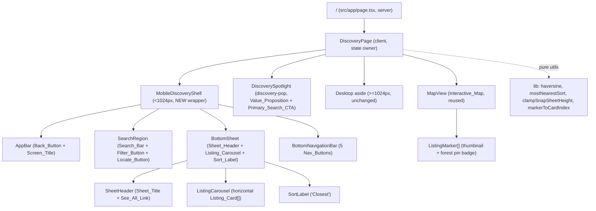
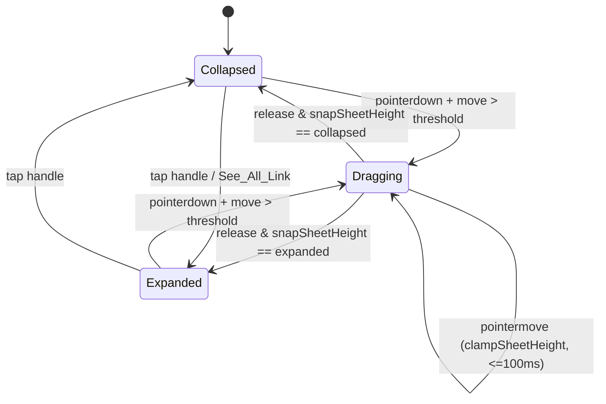
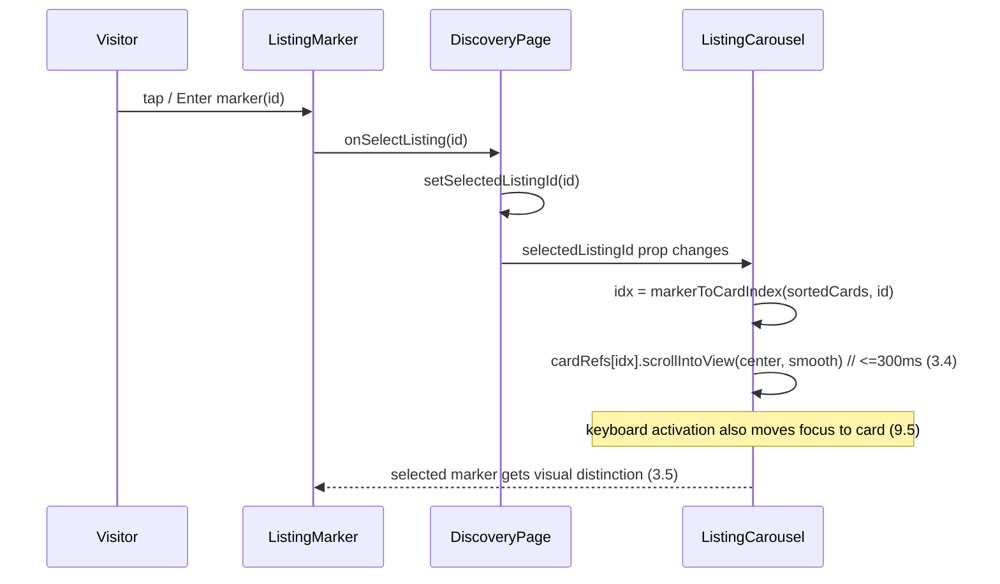
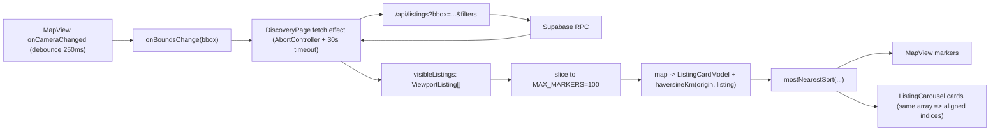

# Design Document — Mobile_Map_Discovery

## Overview

Mobile_Map_Discovery is a mobile-only (viewport width < 1024px) layout redesign of the existing map-based Discovery experience that already renders at the site root path (`/`). It is **presentational and layout-focused**: it re-shapes the mobile chrome of the existing `DiscoveryPage` client component (`src/features/map-discovery/discovery-page.tsx`) into a coherent screen composed of an App_Bar, a Search_Bar with Filter/Locate quick actions, a full Interactive_Map with custom Listing_Markers, a draggable Bottom_Sheet hosting a horizontal Listing_Carousel and a Sort_Label, and a Bottom_Navigation_Bar.

Data fetching (`/api/listings?bbox=...`), filtering logic, and the Google Maps mechanics are **reused as-is**. No new route is introduced — the experience stays at `/` and simply swaps presentation at the 1024px boundary (Requirement 8.4, 8.5, 8.6, 10.1).

The redesign sits *underneath* the already-implemented `discovery-pop` enhancements. The `<DiscoverySpotlight>` modal (Value_Proposition + Primary_Search_CTA "Search locations") continues to render on top, and the redesigned Bottom_Sheet absorbs the responsibilities of the discovery-pop **Mobile_Sheet** (Requirement 10.2, 10.3, 10.4).

This design tracks every decision back to the requirement numbers in `requirements.md` and calls out two data gaps explicitly: the source of **star rating + review count** (not present in the API today) and the **origin point for distance** computation (see Open Questions / Data Gaps).

### Design Goals

- Reorganize the existing inline mobile sheet (`<section lg:hidden>`) and floating mobile search pill into named, extractable components without changing data flow.
- Preserve the existing bbox-driven fetch, AbortController cancellation, and reverse-geocoding behavior.
- Extract **pure functions** (haversine distance, "Most Nearest" sort, sheet-height clamp/snap, marker↔card index mapping) so they are unit- and property-testable today under the existing Vitest (`node` environment) + fast-check setup.
- Use only brand color tokens (`forest`, `ink`, etc.) for the Screen_Title, Active_Nav_Button, and Listing_Marker pin badge (Requirement 10.5).

### Non-Goals

- Changing the listings API contract beyond an additive, optional rating/reviewCount field (see Data Gaps).
- Altering desktop (≥1024px) layout, which keeps the existing right-hand `<aside>` panel.
- Replacing Google Maps or the `@vis.gl/react-google-maps` integration.

---

## Architecture

### Where it slots into the existing code

`DiscoveryPage` remains the single stateful owner (URL sync, `visibleListings`, `selectedListingId`, sheet state, bounds, filters). The redesign extracts the existing **inline** mobile chrome into dedicated components rendered only below 1024px, while the existing desktop `<aside>` is untouched. The mobile/desktop split continues to use Tailwind's `lg:` breakpoint (1024px) plus the existing `window.innerWidth >= 1024` guards.



### Component breakdown

All new components live under `src/features/map-discovery/mobile/` and are pure presentation driven by props/callbacks from `DiscoveryPage`. Shared logic moves into `src/features/map-discovery/lib/` as pure functions.

| Component | Requirements | Responsibility |
|---|---|---|
| `MobileDiscoveryShell` | 8.1, 8.2, 8.4, 10.1 | `lg:hidden` flex column owning vertical layout, safe-area insets, no horizontal overflow. |
| `AppBar` | 1.1–1.7 | Fixed top bar; Back_Button (≥44px, accessible name, focus ring) + centered, truncating Screen_Title "Listings Near You". |
| `SearchRegion` | 2.1–2.8 | Hosts Search_Bar (placeholder names listing name + location), Filter_Button, Locate_Button to its right; reuses existing search state. |
| `InteractiveMap` (existing `MapView`) | 3.1–3.8 | Full-width map; renders ListingMarkers; pointer responsiveness. |
| `ListingMarker` | 3.2–3.6, 10.5 | Rounded thumbnail + forest pin badge; selected/active visual distinction; placeholder on image failure. |
| `BottomSheet` | 4.1–4.10, 10.4 | ~~Draggable panel; clamp/snap math; hosts header, carousel, sort label.~~ **Removed.** Superseded by the page's inline heroSlot sheet; `lib/sheet.ts` clamp/snap math is retained (still property-tested). |
| `SheetHeader` | 4.2, 4.10 | ~~Sheet_Title "Nearby Listings" + See_All_Link.~~ **Removed** with `BottomSheet`; the heroSlot renders its own header inline. |
| `ListingCarousel` | 5.1–5.9 | Horizontal snap-scroll row of Listing_Cards; loading/empty/error/retry states. |
| `ListingCard` | 5.2–5.5 | Photo, title, rating+reviews, price, distance, beds/baths; reuses `<PropertyCard compact>` pattern. |
| `SortLabel` | 6.1, 6.2, 6.6 | "Closest" label shown only when ≥1 card. |
| `BottomNavigationBar` | 7.1–7.8, 9.4 | ~~Five Nav_Buttons; one Active_Nav_Button.~~ **Removed** (chrome-light direction); see Requirement 7. |

### Responsive boundary (1024px)

The existing code already gates mobile chrome with `lg:hidden` and `window.innerWidth >= 1024`. The redesign keeps this contract:

- `< 1024px`: `MobileDiscoveryShell` renders; desktop `<aside>` is hidden (`lg:flex`).
- `≥ 1024px`: existing non-mobile Discovery layout renders; `MobileDiscoveryShell` is hidden.
- Switching is driven purely by CSS media queries (`lg:`) plus a `matchMedia('(min-width: 1024px)')` listener so React-driven behaviors (focus targets, sheet sizing) re-evaluate within the 500ms budget of Requirement 8.5/8.6. CSS class toggling is effectively instantaneous; the `matchMedia` listener handles the JS-side state.

---

## Components and Interfaces

### MobileDiscoveryShell

```ts
type MobileDiscoveryShellProps = {
  // App bar
  onBack: () => void;
  screenTitle: string;                 // "Listings Near You"
  // Search region (reuses existing DiscoveryPage state)
  searchQuery: string;
  onSearchChange: (value: string) => void;
  onSearchSubmit: () => void;
  onToggleFilters: () => void;
  onLocate: () => void;
  searchInputRef: React.Ref<HTMLInputElement>;
  // Sheet + carousel
  cards: ListingCardModel[];
  selectedListingId?: string;
  isLoading: boolean;
  error: string | null;
  onRetry: () => void;
  onSelectCard: (id: string) => void;
  onSeeAll: () => void;
  sheet: BottomSheetController;         // see Bottom_Sheet section
  // Nav
  activeNav: NavKey;
};
```

`MobileDiscoveryShell` is a `lg:hidden` flex column. The Interactive_Map already fills `absolute inset-0` behind the chrome; the shell renders the App_Bar (fixed top), the Search_Bar region (below App_Bar), the Bottom_Sheet (overlaying the lower map), and the Bottom_Navigation_Bar (anchored bottom). Vertical reservations use existing tokens: `--mobile-safe-top`, `--mobile-bottom-nav-h` (80px), `--mobile-safe-bottom`.

### AppBar (Requirement 1)

- Fixed at top via `fixed top-0 inset-x-0`, `z-[var(--z-chrome)]`, `padding-top: var(--mobile-safe-top)`; remains visible while content scrolls (1.1).
- Screen_Title centered using a 3-column grid `[44px_minmax(0,1fr)_44px]` so the title is truly centered between Back_Button and a symmetric right spacer; title uses `truncate` for trailing ellipsis (1.2).
- Back_Button: `min-h-[var(--mobile-touch-min)] min-w-[var(--mobile-touch-min)]` (≥44×44, 1.3), `aria-label="Go back"` (1.6), `focus-visible:ring-2 focus-visible:ring-forest` (1.7), activatable by tap/Enter/Space as a native `<button>` (1.4).
- Back behavior (1.4, 1.5): use Next.js router. On activate, if `window.history.length > 1` call `router.back()`, else `router.push('/')` (default landing view).

### SearchRegion (Requirement 2)

- Positioned immediately below App_Bar with no interactive control between them (2.1).
- Reuses the existing mobile search `<form role="search">` and `searchQuery` state; placeholder text names both inputs, e.g. `"Search by listing name or location"` (2.2).
- Filter_Button and Locate_Button are circular icon buttons horizontally aligned to the right of the input, inside the same region (2.3), each ≥44×44 with non-empty `aria-label` ("Filter listings", "Use my location") (2.7, 8.3).
- Filter_Button reuses the existing `setShowFilters` toggle → `FilterBar` appears (≤1s, synchronous render) (2.4).
- Locate_Button (2.5, 2.6): calls `navigator.geolocation.getCurrentPosition` with a 10s timeout. On success, recenter the map (`map.panTo` + zoom) so the user location is centered. On timeout/denial, show a non-blocking message ("Current location unavailable") and leave the map's center/zoom unchanged. A `MapView` imperative handle (or a callback prop `onLocate`) exposes recenter; the design adds an `onRequestRecenter(coords)` callback that `DiscoveryPage` forwards to `MapView`.
- Search_Bar is keyboard-reachable, shows a focus ring, accepts 1–200 chars (`maxLength=200`) (2.8).

### InteractiveMap + ListingMarker (Requirement 3)

- The existing `MapView` already spans full width behind the chrome and fills the vertical area between Search_Bar and Bottom_Sheet (3.1).
- Marker count is capped at 100 (3.2): `DiscoveryPage` slices the mapped listings to `MAX_MARKERS = 100` before passing to `MapView`. (Carousel cards are derived from the same capped + sorted list to keep marker↔card indices aligned.)
- `ListingMarker` upgrades the existing `.roomza-price-pin` `<AdvancedMarker>` content to render a **rounded thumbnail** (`next/image`, rounded, fixed size) with a **forest pin badge beneath** (3.3, 10.5 — badge uses `bg-forest`, no literal colors). On thumbnail error, swap to a placeholder icon/image (3.6, with a 5s fallback timer).
- Activating a marker (3.4, 3.5): `onSelectListing(id)` sets `selectedListingId`. The selected marker gets a visual distinction (existing `roomza-price-pin-selected` scale/`ink` treatment) (3.5), and the Listing_Carousel scrolls to the corresponding card within 300ms (3.4) via `scrollIntoView({ behavior: 'smooth', inline: 'center' })` driven by the `markerToCardIndex` mapping.
- Empty view after successful load → no markers (3.7) (already true: empty `visibleListings`).
- Pointer responsiveness (3.8): map gesture handling stays `greedy`; no blocking work on the main thread during pointer input (sort/distance computed in memoized selectors, not on pointer events).

### Bottom_Sheet (Requirement 4, 10.4)

The existing inline sheet already implements a pointer-drag height machine. The redesign extracts it into a `BottomSheet` component and a pure controller, and **changes the bounds** to the spec's 25%/90% of viewport height (replacing the current `PEEK_RATIO=0.46` / `EXPANDED_RATIO=0.72`).

```ts
// Pure model (testable). All heights in CSS px; vh = visualViewport height.
const SHEET_MIN_RATIO = 0.25;  // Requirement 4.5
const SHEET_MAX_RATIO = 0.90;  // Requirement 4.4

type SheetSnap = "collapsed" | "expanded";

// Clamp a candidate height to [25%vh, 90%vh] (Requirement 4.6)
function clampSheetHeight(candidate: number, vh: number): number;

// Snap to nearer bound after release (Requirement 4.7)
function snapSheetHeight(currentHeight: number, vh: number): SheetSnap;

// Resolve a snap state to a concrete height
function snapToHeight(snap: SheetSnap, vh: number): number;
```

- Bottom_Sheet overlays the lower map (4.1) and shows Sheet_Header with "Nearby Listings" + See_All_Link (4.2).
- During drag, height tracks the pointer (reusing the existing `pointermove` handler) and updates within 100ms (4.3); drag uses `transition-none`, release uses a ≤300ms height transition (4.7).
- Upward drag grows the sheet up to 90%vh (4.4); downward shrinks to 25%vh (4.5); beyond either bound clamps (4.6) via `clampSheetHeight`.
- On release, `snapSheetHeight` chooses the nearer of 25%/90% and animates within 300ms (4.7).
- At the 25% collapsed height, the Sheet_Header and at least one carousel row stay visible (4.8). The 25%vh minimum must be ≥ the intrinsic height of header + one card row; the design enforces `effectiveMin = max(0.25*vh, headerHeight + oneCardRowHeight)` so the guarantee holds on short viewports (documented deviation noted in Open Questions).
- See_All_Link (4.9, 4.10): activates a "full list" presentation occupying ≥90%vh. Implementation: expand the sheet to its max snap **and** route/scroll to the full nearby-listings list (See_All destination — see Data Gaps). Accessible name e.g. `aria-label="See all nearby listings"`.



### Marker ↔ Card synchronization



`markerToCardIndex(cards, id)` is a pure function returning the index of the card whose `id` matches, or `-1`. Because markers and cards derive from the **same sorted+capped array**, marker index and card index are identical, which the property test verifies.

### ListingCard (Requirement 5)

Reuses the `<PropertyCard compact>` visual pattern and extends it for the carousel context with rating/review/distance. Because `PropertyCard` does not render rating/distance, the carousel uses a thin `ListingCard` wrapper that composes `PropertyCard` plus a rating+distance strip (additive, no change to the shared component's public contract).

- Renders photo, title (1–80 chars), star rating (0.0–5.0, one decimal), review count (0–9,999), price (>0 with `R` currency), distance (0.0–999.9, one decimal, with unit), beds/baths (0–99 each) (5.2, 5.3).
- Activating a card opens the detail view within 1s (5.4) → reuses existing `handleViewDetail(id)`.
- Photo failure within 10s → placeholder (5.5) (reuses `PropertyCard`'s `Building2` fallback).
- Loading → carousel shows skeletons (5.6); empty after success → empty-state message (5.7) (reuses `EmptyStateCapture`).
- Fetch failure or >30s → error indication + retry control, retaining previously shown cards (5.8); retry re-requests + shows loading (5.9). Implemented in `DiscoveryPage`'s fetch effect by adding a 30s timeout to the existing AbortController flow and not clearing `visibleListings` on error.

### SortLabel (Requirement 6)

- Shown directly below the carousel only while ≥1 card exists (6.1, 6.6); exact text "Closest" (6.2).
- The carousel order is produced by `mostNearestSort` (see Data Models) which orders by ascending distance (6.3), keeps equal-distance cards consecutive in any order (6.4, stable), and places undeterminable-distance cards last (6.5).

### BottomNavigationBar (Requirement 7, 9)

- Anchored to the bottom, height `var(--mobile-bottom-nav-h)`, stays visible while content scrolls (7.1); `z-[var(--z-chrome)]`, above the map, below nav menu/spotlight.
- Exactly five Nav_Buttons in order: Home, Discovery, List, Saved, Profile (7.2).
- Default Active_Nav_Button is **Discovery** until another is activated (7.3); exactly one active at a time (7.6); active uses `text-forest`/`bg-forest` token (7.5, 10.5) **and** a non-color indicator (persistent text label + filled/thicker icon) so active state is color-independent (9.4).
- Each Nav_Button has an accessible name equal to its destination (7.7); reachable in visual order via keyboard (9.1); focus ring contrast ≥3:1 (9.2); role exposed (native `<a>`/`<button>`) (9.6).
- Navigation completes within 1s (7.4); on failure/timeout show an error indication and retain the previous Active_Nav_Button (7.8). See Data Gaps for destination route mapping.

### Accessibility model (Requirement 9)

- DOM order = visual order (App_Bar → Search region → map → sheet → bottom nav) so sequential tab order matches top-to-bottom, left-to-right (9.1); no keyboard trap (the Spotlight modal already manages its own focus trap and is separate).
- Visible focus indicators with ≥3:1 contrast on Back_Button, Filter_Button, Locate_Button, See_All_Link, Listing_Cards, Nav_Buttons (9.2).
- Text contrast ≥4.5:1 for Screen_Title and Listing_Card text (9.3) — `text-ink` on `panel`/`warm-surface` satisfies this with the existing tokens.
- Active_Nav_Button conveys state via non-color means (9.4).
- Keyboard marker activation moves focus to the corresponding card (9.5) (focus the card element after `scrollIntoView`).
- Accessible name + role exposed for all named controls (9.6).

### Brand tokens (Requirement 10.5)

Screen_Title, Active_Nav_Button, and Listing_Marker pin badge use only token-backed classes (`text-ink`, `text-forest`, `bg-forest`). No hex/rgb literals for these elements. This is enforced by a Testing Strategy lint/grep check over the new component files.

---

## Data Models

```ts
// Reused from the existing fetch (unchanged shape).
type ViewportListing = {
  id: string;
  title: string;
  area: string;
  price: number;
  latitude: number;
  longitude: number;
  bedrooms: number;
  bathrooms: number;
  imageUrls: string[];
  availabilityDate: string | null;
  created_at: string | null;
};

// Geographic origin used to compute distance (see Data Gaps for which origin).
type GeoPoint = { lat: number; lng: number };

// View model consumed by ListingCard / ListingCarousel.
type ListingCardModel = {
  id: string;
  title: string;            // 1..80 chars (Req 5.2)
  imageUrls: string[];
  price: number;            // > 0 (Req 5.2)
  bedrooms: number;         // 0..99 (Req 5.3)
  bathrooms: number;        // 0..99 (Req 5.3)
  rating: number | null;    // 0.0..5.0, one decimal — OPTIONAL/derived (Data Gap)
  reviewCount: number | null; // 0..9999 — OPTIONAL/derived (Data Gap)
  distanceKm: number | null;  // null => undeterminable (Req 6.5); computed via haversine
};
```

### Pure transformation functions (extracted for testability)

```ts
// src/features/map-discovery/lib/distance.ts
// Great-circle distance in km between two points. Symmetric, identity = 0.
export function haversineKm(a: GeoPoint, b: GeoPoint): number;

// src/features/map-discovery/lib/sort.ts
// "Most Nearest": ascending distanceKm; null distances last; stable for ties.
export function mostNearestSort(cards: ListingCardModel[]): ListingCardModel[];

// src/features/map-discovery/lib/sheet.ts
export function clampSheetHeight(candidate: number, vh: number): number;        // [0.25vh, 0.90vh]
export function snapSheetHeight(currentHeight: number, vh: number): "collapsed" | "expanded";

// src/features/map-discovery/lib/marker-sync.ts
// Index of the card matching id within the rendered (sorted+capped) list, or -1.
export function markerToCardIndex(cards: ListingCardModel[], id: string): number;
```

### Data flow (reused bbox fetch)



---

## Correctness Properties

*A property is a characteristic or behavior that should hold true across all valid executions of a system — essentially, a formal statement about what the system should do. Properties serve as the bridge between human-readable specifications and machine-verifiable correctness guarantees.*

Most acceptance criteria for this feature are layout, routing, timing, or external-service concerns better verified by Playwright/axe (see Testing Strategy). The properties below cover the **pure logic** extracted into `src/features/map-discovery/lib/` — the parts where behavior varies meaningfully with input and where 100+ generated cases reveal edge cases. Each is implemented with a single fast-check property test running ≥100 iterations.

### Property 1: Marker capping preserves a bounded prefix

*For any* array of listings, capping to a maximum of 100 produces an output whose length equals `min(input.length, 100)`, whose elements are exactly the first `min(input.length, 100)` elements of the input in order, and which is empty when the input is empty.

**Validates: Requirements 3.2, 3.7**

### Property 2: Marker-to-card index mapping is consistent

*For any* rendered (sorted and capped) list of `ListingCardModel`, `markerToCardIndex(cards, id)` returns an index `idx` such that `cards[idx].id === id` when `id` is present, and returns `-1` when `id` is absent. Because markers and cards are derived from the same array, this index also identifies the marker's card.

**Validates: Requirements 3.4**

### Property 3: Sheet height clamp stays within bounds

*For any* candidate height and viewport height `vh`, `clampSheetHeight(candidate, vh)` returns a value within `[0.25 * vh, 0.90 * vh]`; it returns `0.25 * vh` when the candidate is below the minimum, `0.90 * vh` when above the maximum, and the unchanged candidate when already within bounds.

**Validates: Requirements 4.4, 4.5, 4.6**

### Property 4: Sheet release snaps to the nearer bound

*For any* current height and viewport height `vh`, `snapSheetHeight(currentHeight, vh)` resolves to `"expanded"` when the height is at or above the midpoint of the 25% and 90% bounds and `"collapsed"` otherwise, and the resolved snap always corresponds to exactly one of the two bound heights.

**Validates: Requirements 4.7**

### Property 5: "Most Nearest" ordering is correct, stable, and null-last

*For any* list of `ListingCardModel`, `mostNearestSort` returns a permutation of the input in which: (a) cards with a determinable `distanceKm` appear in non-decreasing distance order; (b) cards with equal distance preserve their relative input order (stable); and (c) every card with a null (undeterminable) distance appears after every card with a determinable distance.

**Validates: Requirements 6.3, 6.4, 6.5**

### Property 6: Bottom navigation has exactly one active button

*For any* activated navigation key drawn from {Home, Discovery, List, Saved, Profile}, resolving the navigation state yields exactly one Active_Nav_Button, and that active button is the one corresponding to the activated key (with Discovery active by default before any activation).

**Validates: Requirements 7.5, 7.6**

### Property 7: Listing card formatters respect precision and ranges

*For any* valid rating in `[0.0, 5.0]`, distance in `[0.0, 999.9]`, and price `> 0`, the card formatters produce a rating string with exactly one decimal place, a distance string with exactly one decimal place plus a unit, and a price string carrying the `R` currency indication; values outside their valid ranges are rejected or clamped rather than rendered.

**Validates: Requirements 5.2, 5.3**

---

## Error Handling

| Scenario | Requirement | Handling |
|---|---|---|
| Geolocation denied or >10s timeout | 2.6 | Show "Current location unavailable" message; leave map center/zoom unchanged. |
| Marker thumbnail load failure (5s) | 3.6 | Swap to placeholder image via `onError` + 5s fallback timer. |
| Listing photo load failure (10s) | 5.5 | Reuse `PropertyCard` `Building2` placeholder. |
| Listings fetch fails or exceeds 30s | 5.8 | Show error indication + retry control; **retain** previously rendered cards (do not clear `visibleListings`). |
| Retry activated | 5.9 | Re-issue bbox fetch (new AbortController) and show loading indication. |
| Navigation does not complete within 1s | 7.8 | Show navigation error indication; retain previous Active_Nav_Button. |
| Value_Proposition / Primary_Search_CTA fails to load | 10.3 | Render an error indication for the affected element; stay at `/`. |
| Empty result after successful load | 5.7, 6.6 | Show empty-state message; hide Sort_Label. |

Implementation notes:
- The existing fetch effect already uses `AbortController` and ignores `AbortError`. Add a 30s timeout (e.g. `setTimeout(() => controller.abort(), 30000)`) and, on error, set an error flag **without** clearing the current list to satisfy 5.8 retention.
- Geolocation and navigation timeouts use `Promise.race` with a timer so the UI can fall back deterministically.

---

## Testing Strategy

### Approach

A dual approach is used. Property-based tests cover the extracted pure logic; example/integration tests (Playwright) cover layout, routing, timing, a11y, and external-service behavior. This split is driven by the existing tooling constraints:

- **Vitest** is configured for `src/**/*.test.ts` (`.ts` only) in the **`node`** environment. There is **no jsdom / @testing-library** configured, so component DOM assertions are not runnable today without adding those deps. Therefore the design deliberately **extracts pure functions** into `src/features/map-discovery/lib/*.ts` so they are unit/PBT-testable now.
- **fast-check ^4.8.0** is installed and used for the property tests below.
- **Playwright** covers DOM/layout/interaction/a11y criteria (the majority of the spec, which is presentational).

### Property-based tests (fast-check, ≥100 iterations each)

Located alongside the pure modules as `*.test.ts` (node env). Each test is tagged with a comment referencing its design property:

`// Feature: mobile-map-discovery, Property {n}: {property text}`

| Property | Pure module under test | Generators |
|---|---|---|
| P1 Marker capping | `lib/cap.ts` → `capListings` | arrays of listing-like objects of length 0..300 |
| P2 Marker↔card mapping | `lib/marker-sync.ts` → `markerToCardIndex` | sorted card arrays + ids in/out of set |
| P3 Sheet clamp | `lib/sheet.ts` → `clampSheetHeight` | arbitrary candidate (incl. negative/huge) + vh > 0 |
| P4 Sheet snap | `lib/sheet.ts` → `snapSheetHeight` | arbitrary height + vh > 0 |
| P5 Most Nearest sort | `lib/sort.ts` → `mostNearestSort` | card arrays with `distanceKm: number \| null`, duplicate distances |
| P6 Nav exactly-one-active | `lib/nav.ts` → `resolveActiveNav` | nav key from the 5-element set; activation sequences |
| P7 Card formatters | `lib/format.ts` → `formatRating/formatDistance/formatPrice` | rating 0..5, distance 0..999.9, price >0, plus out-of-range values |

### Unit / example tests

- Back-button branch (1.4, 1.5): `history.length` decision → `router.back()` vs `router.push('/')`.
- Static content assertions where feasible without DOM (kept minimal; most move to Playwright).

### Playwright (layout, interaction, a11y, responsive)

Covers: App_Bar fixed/centered/truncation (1.1, 1.2), touch targets ≥44px (1.3, 8.3), focus rings (1.7, 9.2), search region layout + placeholder (2.1–2.3, 2.8), filter/locate interactions incl. mocked geolocation (2.4–2.6), marker visuals + selected state + carousel scroll-to-card timing (3.3–3.5, 9.5), sheet drag/clamp/snap/See_All in a real viewport (4.1–4.9), carousel states loading/empty/error/retry (5.1, 5.4–5.9, 6.1, 6.6), bottom nav order/active/navigation/error (7.1–7.4, 7.7, 7.8), responsive no-overflow across 360–1023px and the 1024px switch (8.1–8.6), tab order and contrast via axe (9.1–9.3, 9.4, 9.6), and discovery-pop consistency (10.1–10.4). A static grep/lint check enforces brand-token-only usage on the Screen_Title, Active_Nav_Button, and marker badge (10.5).

### Property test configuration

- Library: fast-check (already installed).
- Iterations: `fc.assert(fc.property(...), { numRuns: 100 })` minimum.
- Each property test references its design property number via the tag comment above.
- Do not reimplement PBT machinery; use fast-check arbitraries.

---

## Open Questions / Data Gaps

These items are **not resolved by the current codebase** and need a product/data decision before or during implementation. Defaults are proposed so implementation is not blocked.

1. **Star rating + review count source (Req 5.2).** The `/api/listings` response and `ViewportListing` have **no** `rating` or `reviewCount` fields today. Options: (a) add `rating`/`review_count` to the Supabase RPC and API response (preferred, additive); (b) treat them as optional/derived and render gracefully when absent. **Proposed default:** model them as `rating: number | null` / `reviewCount: number | null` on `ListingCardModel` and hide the rating strip when null, pending the API addition. The formatter property (P7) only asserts behavior for present, in-range values.

2. **Distance origin point (Req 5.3, 6.3).** There is no stored visitor location or distance field. Distance is computed **client-side via `haversineKm(origin, listing)`**. What is `origin`? Options: (a) the visitor's geolocation when granted; (b) the current **map center** (always available from `onCenterNameChange`/camera). **Proposed default:** use visitor geolocation when available, otherwise fall back to map center; when neither is usable, `distanceKm = null` (sorted last per 6.5).

3. **See_All destination (Req 4.9, 4.10).** "Full list of nearby listings occupying ≥90% vh." Is this an in-place expanded sheet, or a dedicated list route? **Proposed default:** in-place — expand the Bottom_Sheet to its max snap and switch the carousel to a vertical full list; no new route (consistent with Req 8.4/10.1). Confirm whether a separate `/listings` route is desired instead.

4. **Bottom_Nav destination mapping (Req 7.2).** The spec names Home, Discovery, List, Saved, Profile, but the existing renter nav is Explore(`/`), Saved(`/saved`), Applications(`/applications`), Messages(`/messages`), Profile(`/profile`). Proposed mapping: **Home → `/`**, **Discovery → `/` (active default)**, **Saved → `/saved`**, **Profile → `/profile`**, and **List → ?**. "List" has **no existing route** — options: map to listing creation (`/dashboard/listings/new`, role-gated), a future `/listings` browse route, or reuse Applications/Messages. Home and Discovery both pointing at `/` is ambiguous. **Needs product decision** on the five concrete destinations and the "List" route.

5. **Sheet minimum vs. content height (Req 4.8).** 25% of a short viewport may be less than the intrinsic height of the Sheet_Header + one card row. The design enforces `effectiveMin = max(0.25*vh, headerHeight + oneCardRowHeight)`, which can exceed the literal 25% on small devices. Confirm this is acceptable (it favors the 4.8 visibility guarantee over the exact 25% figure).
