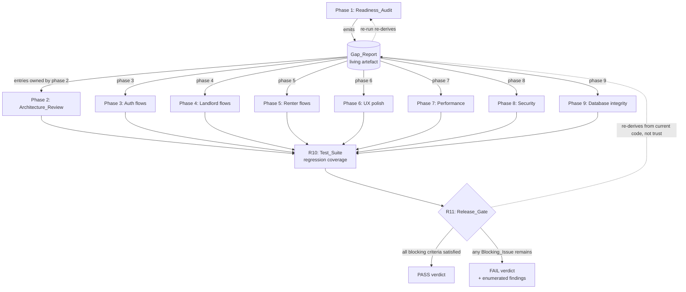
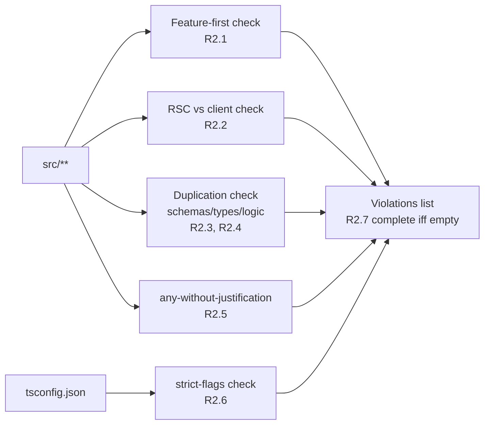
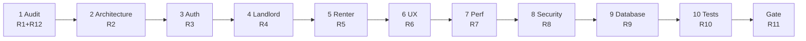

# Design Document: Production Readiness & Launch Hardening

## Overview

This design describes how the **Production Readiness & Launch Hardening** initiative takes RoomZA from its current state to a genuinely launch-ready product. It is a **hardening and completion** pass, not a redesign. The map-first discovery surface (Google Maps via `@vis.gl/react-google-maps`), bento-grid layouts, OKLCH brand tokens (`--forest`, `--moss`, `--clay`, `--gold`, `--ink`, `--warm-surface`), and the minimal, deliberate interface are preserved exactly as they exist today.

The work is organised as a **nine-phase pipeline** mapped 1:1 onto Requirements 1–11 (with Requirement 12 cross-cutting all phases):

| Phase | Requirement | Concern | Produces / Consumes |
|---|---|---|---|
| 1 | R1, R12 | Readiness Audit & Gap Analysis | **Produces** the `Gap_Report` (the living artefact that drives every later phase) |
| 2 | R2 | Architecture Validation | Consumes Gap_Report; appends architecture violations |
| 3 | R3 | Auth flows end-to-end | Consumes/closes Gap_Report entries owned by phase 3 |
| 4 | R4 | Landlord flows end-to-end | Consumes/closes phase-4 entries |
| 5 | R5 | Renter flows end-to-end | Consumes/closes phase-5 entries |
| 6 | R6 | UX polish (improve, not redesign) | Consumes/closes phase-6 entries |
| 7 | R7 | Performance | Consumes/closes phase-7 entries |
| 8 | R8 | Security | Consumes/closes phase-8 entries |
| 9 | R9 | Database integrity | Consumes/closes phase-9 entries |
| — | R10 | Testing coverage | Cross-cutting; protects every closed entry against regression |
| Gate | R11 | Production Readiness Exit Gate | **Consumes** the cumulative result; emits a single pass/fail verdict |

The central design idea is a **data-driven flow**: Phase 1 emits a structured `Gap_Report`, every gap is assigned a severity and an owning phase (R1.8), the owning phase closes its gaps, Phase 10 (testing) adds regression coverage, and the Release Gate (R11) re-derives a verdict from the *current* state of the codebase rather than trusting that gaps were closed. The Gap_Report is a **living artefact** — re-running the audit re-derives entries, and the gate is authoritative.

### Grounding in the existing codebase

The design is grounded in what already exists (confirmed by inspection):

- **Stack**: Next.js 16.2.6 (App Router, RSC), React 19.2.4, TypeScript 5 (`strict: true`), Tailwind 4 + OKLCH tokens, Supabase (`@supabase/ssr`), Cloudflare Workers via `@opennextjs/cloudflare`, Upstash (Redis rate-limit + QStash), Resend, Jitsi (`meet.jit.si`), Zod 3.25, Vitest 4.1 + fast-check 4.8, Playwright 1.60.
- **Feature-first layout** already in place under `src/features/<domain>/` (applications, chat, listings, map-discovery, notifications, viewings, dashboard) with the established pattern **client component → `"use server"` action → Supabase SSR client → Postgres RPC/RLS**, plus pure logic extracted into colocated `*.ts` with `*.test.ts`.
- **Shared libs** under `src/lib/`: `auth.ts` (`getSessionProfile`/`requireUser`/`requireRole`), `env.ts` (Zod env), `logger.ts` (structured + redaction), `rate-limit.ts` (`consumeRateLimit`), `qstash.ts`, `roles.ts`, `turnstile.ts`, `redirects.ts` (`safeRedirectPath`), `action-result.ts` (`ActionResult` union), `api.ts` (`apiSuccess`/`apiFailure`).
- **27 migrations** under `supabase/migrations/` (naming `YYYYMMDDHHMMSS_snake_case.sql`), PostGIS enabled with a GIST index `listings_location_gix`, RLS hardening passes, and DB test plans `supabase/tests/rls-test-plan.sql` + `infra-hardening-test-plan.sql` run in CI.
- **CI** (`.github/workflows/ci.yml`): `app` job (lint → typecheck → unit tests → build → audit) and `database` job (supabase start → `db reset` → RLS test plan → infra hardening). No e2e or load test runs in CI today.

### Known gaps this design must close (already identified during grounding)

These are seed inputs to the Phase-1 audit, confirmed by inspection:

1. **Zero `loading.tsx` / `error.tsx` / `not-found.tsx`** anywhere in `src/app` (only `app/layout.tsx` and `app/dashboard/layout.tsx` exist). Directly impacts R1.4, R6.2–R6.5.
2. **Rate limiting and Turnstile degrade *open*** when their env vars are absent (`consumeRateLimit` returns `success:true, reason:"not_configured"`; `verifyTurnstileToken` returns `true` in non-production). Impacts R8.5, R8.6.
3. **Secrets committed in `wrangler.jsonc` `vars`** (Supabase anon key + Google Maps API key in plaintext). Impacts R8.10.
4. **CI omits e2e, load, and coverage gates.** Impacts R10.3, R11.
5. **Inconsistent action contract** — most actions return `ActionResult`, but some viewing actions return ad-hoc `{ error }`/`{ success }`. Impacts R2.3.
6. **`tsconfig` enables only the umbrella `strict`** flag — `noUncheckedIndexedAccess`, `exactOptionalPropertyTypes`, etc. are not explicitly enabled. Impacts R2.6.
7. **Stale spec checkboxes** (`mobile-map-discovery` lists 7 optional property tests as unchecked though several files exist) and **missing `tasks.md`** for `landlord-listing-management` and `discovery-pop`. Impacts R12.

## Architecture

### The hardening pipeline



Key architectural properties:

- **Audit feeds all later phases** (R1.8 assigns each gap an owning phase 2–8; R12.2 assigns in-progress-spec tasks an owning phase).
- **The gate verifies the cumulative result independently** — it re-runs the checks (typecheck, lint, tests, console/hydration scans, placeholder/TODO scans, link checks, leak checks) rather than reading "closed" flags (R11.1–R11.10).
- **Single source of truth for security headers** stays in `next.config.ts` `headers()` (middleware deliberately does not set them — preserved).
- **No product redesign** — every phase modifies behaviour, configuration, tests, and missing states only; the map-first composition is untouched (R6.1).

### Tooling architecture

The audit and gate are implemented as **repo-local Node scripts** (TypeScript, run via the existing Node 22 / tsx toolchain) plus CI wiring, so they are reproducible locally and in `.github/workflows/ci.yml`. No new runtime dependencies are introduced into the app bundle.

```
scripts/
  audit/
    run-audit.ts            # orchestrates all collectors → writes gap-report.json + gap-report.md
    collectors/
      readme-features.ts    # R1.1, R1.2  — README features ↔ implementation files
      placeholders.ts       # R1.3        — TODO/FIXME/throw new Error("not implemented")/mock data
      route-states.ts       # R1.4        — routes missing loading/empty/error states
      input-validation.ts   # R1.5        — actions/API/forms lacking Zod validation
      observability.ts      # R1.6        — actions/routes lacking logging/analytics/monitoring
      dead-code.ts          # R1.7        — unreferenced modules/exports
      architecture.ts       # R2.1–R2.6   — feature-first, RSC/client, duplication, any, tsconfig
      db-integrity.ts       # R9.1–R9.9   — FKs, indexes, constraints, RLS, naming, security context
      in-progress-specs.ts  # R1.9, R12   — per-spec task + criteria pass/fail
    severity.ts             # R1.8        — severity + owning-phase assignment rules
  gate/
    run-gate.ts             # R11 — aggregates all checks → single verdict (release-report.json)
    checks/
      typescript.ts         # R11.1
      eslint.ts             # R11.2
      tests.ts              # R11.3, R10.7, R10.8
      console-hydration.ts  # R11.4 (Playwright-driven)
      placeholders.ts       # R11.5, R11.6 (reuses audit collectors)
      links.ts              # R11.7
      cuj-runtime.ts        # R11.8 (dup requests / races / leaks across 10 iterations)
      leaks.ts              # R11.8
```

These scripts are **read-only analysers** — they never mutate application source. Their output is the Gap_Report (audit) and the Release Report (gate).

### Conformance-check architecture (Phase 2)

Architecture validation is expressed as deterministic static checks over the AST/source tree:



- **Feature-first (R2.1)**: domain logic must live under `src/features/<domain>/`. The check flags domain logic (DB access, business rules, state machines) found outside that tree, excluding the allowed shared `src/lib/` utilities and `src/components/ui` primitives.
- **RSC vs client (R2.2)**: a component declaring `"use client"` with no client-only behaviour (no `useState`/`useEffect`/`useRef`/event handlers/browser APIs) is flagged. The check parses each `.tsx`, detects the directive, and scans for client-only signals.
- **Duplication (R2.3, R2.4)**: schemas and shared types must be defined once; identical/semantically-equivalent business logic appearing in ≥2 UI components is flagged.
- **`any` discipline (R2.5)**: each `any` occurrence must be immediately preceded by an inline justification comment; otherwise flagged.
- **Strict TS (R2.6)**: verifies `strict` plus each constituent flag (`noImplicitAny`, `strictNullChecks`, `strictFunctionTypes`, `strictBindCallApply`, `strictPropertyInitialization`, `noImplicitThis`, `useUnknownInCatchVariables`, `alwaysStrict`) and the recommended `noUncheckedIndexedAccess` are enabled; flags any disabled flag by name.

## Components and Interfaces

### 1. Readiness_Audit (Phase 1, R1 + R12)

**Responsibility**: compare the implemented codebase against the README-described product and emit the `Gap_Report`.

**Interface** (`scripts/audit/run-audit.ts`):

```ts
type AuditResult = {
  generatedAt: string;          // ISO timestamp
  commit: string;               // git SHA the audit ran against
  entries: GapEntry[];          // every discovered gap (see Data Models)
  specResults: SpecResult[];    // R1.9, R12.1 per in-progress spec
  summary: {
    byCategory: Record<GapCategory, number>;
    bySeverity: Record<Severity, number>;
    byOwningPhase: Record<OwningPhase, number>;
  };
};

function runAudit(): Promise<AuditResult>;
```

**Collectors** (each appends `GapEntry[]`):

- `readme-features` — parses README feature sections, resolves each to implementation file path(s) or `"missing"` (R1.1, R1.2).
- `placeholders` — greps for TODO/FIXME, `throw new Error("not implemented")`, commented-out logic, and mock/hardcoded sample data; records file path (R1.3).
- `route-states` — enumerates reachable routes in `src/app`, checks each for `loading.tsx`/empty-state/`error.tsx` (or in-component equivalents), records which of the three is absent (R1.4). **This collector will flag every current route**, because no boundary files exist yet.
- `input-validation` — finds every API route, Server Action, and form that accepts input and lacks Zod validation on ≥1 field (R1.5).
- `observability` — finds user-facing actions/API routes lacking `logger` calls, analytics events, or monitoring; records which is absent (R1.6).
- `dead-code` — builds an import graph rooted at app entry points and flags unreferenced modules/exports (R1.7).
- `in-progress-specs` — for each of the four specs, reads `tasks.md` (if present) and records remaining incomplete tasks and a pass/fail against R3–R11 criteria; if `tasks.md` is missing/unreadable, records `audit-incomplete` and does **not** mark the spec passed (R1.9, R12.1–R12.4).

**Severity & owning-phase assignment** (`severity.ts`, R1.8): every entry gets exactly one `severity ∈ {blocker, major, minor}` and exactly one `owningPhase ∈ {2..8}`, via deterministic rules (e.g., missing input validation → `blocker`/phase 8; missing route error state → `major`/phase 6; dead code → `minor`/phase 2; missing FK → `blocker`/phase 9).

**Self-reporting (R1.10)**: if a reachable route or source file cannot be analysed, the audit records an `audit-incomplete` entry with the file path and the reason — the audit never silently skips.

### 2. Gap_Report store (Data artefact)

Persisted at `.kiro/specs/production-readiness-hardening/gap-report.json` (machine-readable, authoritative) and a generated `gap-report.md` (human review). It is the **living artefact**: re-running the audit regenerates both. Each later phase reads entries filtered by `owningPhase` and marks them resolved by *fixing the code* — resolution is then confirmed by re-running the relevant collector, never by hand-editing the report.

### 3. Architecture_Review (Phase 2, R2)

Implemented by `architecture.ts`; emits violations into the Gap_Report with category `architecture`. The phase is **complete only when the violations list is empty** (R2.7) — this is the phase's exit condition and is re-verified by the gate's typecheck/lint stages plus a dedicated architecture test.

### 4. Flow completion (Phases 3–5, R3–R5)

These phases **complete existing flows on the existing architecture**; they do not introduce a new layering. Each flow is verified end-to-end along the established chain:

```
UI component (client) → "use server" action (Zod validate → requireUser/requireRole)
  → Supabase SSR client → Postgres RPC (atomic, RLS-enforced) → notification outbox → revalidatePath
```

**Auth_System (R3)** — surfaces under `src/app/auth/*` (`callback`, `forgot-password`, `reset-password`, `sign-out`) plus `lib/auth.ts`, `lib/redirects.ts`, `lib/supabase/middleware.ts`. Gaps to fill against R3: account-lockout after 5 failed attempts for ≥15 min (R3.3), non-enumerating reset response with 60-min token (R3.5), "remember me" 30-day persistence (R3.12), and complete OAuth/verification error paths (R3.14, R3.15). Auth gating remains **per-page via `requireUser`/`requireRole`**, with session refresh in middleware (preserved). Return-to-original-route after login uses the existing `safeRedirectPath` open-redirect guard (R3.11).

**Landlord_Workspace (R4)** — `src/app/dashboard/*` + `src/features/listings`, `src/features/applications`, `src/features/viewings`, `src/features/chat`. Completes listing CRUD with image-bound enforcement (1–20 images, ≤10 MB, JPEG/PNG/WebP — R4.5, R4.6), approve/reject transitions wired to the notification outbox (R4.9, R4.10) via the existing `update_application_status_checked` RPC + `isPermittedTransition` guard, viewing-slot proposal (R4.11), dashboard analytics (views + applicant counts, R4.14), and ownership-denied authz (R4.16) via RLS + manual ownership checks already present in `getListingApplicants`/`updateApplicationStatus`.

**Renter_Workspace (R5)** — map discovery, listing detail, saved, applications, viewings, messaging, profile. Completes marker clustering above 200 in-viewport markers (R5.1), viewport query ≤2s (R5.2) over the `listings_in_viewport` RPC + GIST index, application submit via `submit_application_atomic` (R5.6), document bounds (R5.8, R5.9), withdraw (R5.10), viewing acceptance (R5.12), Jitsi join ≤10s with retry (R5.13, R5.14), and message delivery indicators (R5.15) over Supabase Realtime.

**Action-contract normalisation**: viewing actions that currently return ad-hoc `{ error }`/`{ success }` are migrated to the shared `ActionResult` union (closing the R2.3 duplication/consistency gap) without changing behaviour.

### 5. UI_System / UX polish (Phase 6, R6)

**Strict constraint: improve, do not redesign (R6.1).** Polish reuses the existing OKLCH token set and component primitives only.

- **Loading / empty / error pattern (R6.2–R6.5)**: introduce App-Router `loading.tsx` and `error.tsx` boundaries per route segment plus a root `not-found.tsx`, and standardise three reusable primitives in `src/components/ui/` — `<LoadingSkeleton>` (dimensions matched to eventual content within ±10%), `<EmptyState>` (message + ≥1 action), `<ErrorState>` (error + retry, retains prior data until retry succeeds). The map-discovery feature already has `EmptyStateCapture`; the new primitives generalise that pattern.
- **Responsive (R6.7)**: verified at 360 / 768 / 1280 px with no horizontal scroll, overflow, or overlap, preserving the bento grids and the mobile bottom-sheet shell.
- **Accessibility (R6.8, R6.9, R6.13)**: logical focus order, visible focus indicators (≥3:1, reusing `focus-visible:ring-forest`), WCAG 2.1 AA contrast in light + dark mode, 44×44 px touch targets (already applied in `mobile/` components). *Note: full AA conformance requires manual assistive-tech testing beyond automated checks.*
- **Theme + motion (R6.10, R6.11)**: theme switch applied ≤300 ms; micro-interactions ≤300 ms, non-blocking.
- **Touch (R6.12)**: map + bottom sheet drag-to-expand / drag-to-dismiss past a 25% threshold (the existing `clampSheetHeight`/`snapSheetHeight` math in `map-discovery/lib/sheet.ts` is reused).

### 6. Performance_Layer (Phase 7, R7)

- **RSC + streaming (R7.1, R7.5)**: keep server-renderable routes on the server; use Suspense streaming so primary content is interactive before secondary content. The new `loading.tsx` boundaries are the Suspense fallbacks.
- **Code splitting (R7.3)**: heavy client modules — Google Maps, Jitsi embed, dashboard charts/insights — loaded via `next/dynamic` only when required.
- **Images (R7.2)**: currently `images.unoptimized: true`. The performance phase defines a viewport-matched optimisation strategy compatible with Cloudflare Workers (Cloudflare Images / OpenNext image loader), serving optimised formats at rendering dimensions.
- **Spatial query (R7.4, R7.10)**: viewport queries use the GIST index `listings_location_gix`; if the index is unavailable, the query still returns correct results and records the missing-index condition.
- **Caching + prefetch (R7.6, R7.7)**: prefetch likely-next routes; cache repeatable read queries within the configured window.
- **JS budget (R7.8)**: a configured first-load JS budget per route is enforced at build and re-checked by the gate.
- **SSR fallback (R7.9)**: a server-render failure serves a defined fallback (the route `error.tsx`) and records the failure.

### 7. Security_Layer (Phase 8, R8)

- **RLS (R8.1)**: every table with user/listing data enforces RLS such that an unauthenticated query returns zero rows (already the pattern; verified by the DB test plan).
- **Zod at boundaries (R8.2, R8.3)**: every API route and Server Action validates input against a Zod schema before processing, preserving submitted data and indicating invalid input via `fieldErrorFailure`.
- **Authz (R8.4)**: unauthorised resource access denied with no data and a not-authorised indication.
- **Rate limiting (R8.5, R8.6)**: 10 req / 60 s on auth routes, 60 req / 60 s on mutation routes via `consumeRateLimit`. **Fix the fail-open behaviour**: in production, absent Upstash config must fail *closed* (or block deploy), not silently allow. Same hardening for `verifyTurnstileToken` (no production bypass).
- **Sanitisation (R8.7)**: user-supplied content sanitised before render; no injected script executes.
- **Headers (R8.8)**: CSP + HSTS on every route, single-sourced in `next.config.ts` (preserved).
- **File upload (R8.9)**: type + ≤10 MB validation; accepted files stored under storage permissions restricted to authorised users (existing `application-documents`/`listing-images` buckets with storage RLS).
- **Secrets (R8.10)**: all secrets loaded from validated env (`lib/env.ts`); excluded from client bundles and logs (`logger.ts` redaction). **Remove plaintext keys from `wrangler.jsonc`** and move to build-time/secret injection.
- **Audit logging (R8.11)**: security-relevant actions (login, role change, application decision, listing deletion) emit a structured audit entry (actor, action type, timestamp) via `logger`.

### 8. Database_Layer (Phase 9, R9)

Reviews the 27 migrations for: FK on every relationship (R9.1, R9.2), indexes on WHERE/JOIN/ORDER BY columns + PostGIS spatial indexes (R9.3), constraints enforcing invariants (R9.4, R9.5), RLS policies per role per operation (R9.6, R9.7), a single documented naming convention (R9.8 — current convention is `snake_case` tables/columns, `*_idx`/`*_gix` indexes, `verb_noun` functions, descriptive policy names), explicit `security invoker|definer` on functions/triggers (R9.9), and a fresh-DB apply that passes 100% of the RLS test plan (R9.10). Findings feed the Gap_Report (R9.2).

### 9. Test_Suite (R10) and Release_Gate (R11)

See **Testing Strategy** and the **Release_Gate design** below.

### 10. In-progress spec validation (R12)

The four specs are **referenced, not re-specified**. `in-progress-specs.ts` records, per spec, a pass/fail against its own `tasks.md` and against applicable R3–R11 criteria (R12.1), assigns owning phases to launch-required incomplete tasks (R12.2), records `audit-incomplete` for unreadable specs (R12.3), references existing acceptance criteria by identifier without duplicating them (R12.4), and the gate applies R11 with no in-progress exemption (R12.5). Concretely: `conversation-video-calling` tasks are all checked (validate against R5.13/R5.14/R4.12); `mobile-map-discovery` has stale unchecked property-test boxes to reconcile; `landlord-listing-management` and `discovery-pop` lack `tasks.md` and are recorded accordingly.

## Data Models

### Gap_Report entry schema

The core artefact. Defined as a Zod schema (`scripts/audit/schema.ts`) so the report is self-validating.

```ts
const Severity = z.enum(["blocker", "major", "minor"]);            // R1.8
const OwningPhase = z.union([                                       // R1.8 (phases 2–8)
  z.literal(2), z.literal(3), z.literal(4), z.literal(5),
  z.literal(6), z.literal(7), z.literal(8),
]);
const GapCategory = z.enum([
  "missing-feature",     // R1.2
  "placeholder",         // R1.3
  "missing-route-state", // R1.4
  "missing-validation",  // R1.5
  "missing-observability",// R1.6
  "dead-code",           // R1.7
  "architecture",        // R2.x
  "db-integrity",        // R9.x
  "in-progress-spec",    // R1.9, R12
  "audit-incomplete",    // R1.10, R12.3
]);

const GapEntry = z.object({
  id: z.string(),                       // stable hash of {category, filePath, detail}
  feature: z.string(),                  // affected feature/area
  readmeRef: z.string().nullable(),     // section heading or line number (R1.1, R1.2)
  filePaths: z.array(z.string()),       // implementation path(s) or [] when "missing"
  category: GapCategory,
  severity: Severity,                   // exactly one (R1.8)
  owningPhase: OwningPhase.nullable(),  // exactly one for 2–8; null only for audit-incomplete
  detail: z.string(),                   // what is wrong / which state/field/flag is absent
  missingState: z.enum(["loading","empty","error"]).nullable(), // R1.4
  missingObservability: z.enum(["analytics","logging","monitoring"]).nullable(), // R1.6
  reason: z.string().nullable(),        // why unanalysable (R1.10)
  status: z.enum(["open","resolved"]).default("open"),
});
```

**Invariants** (enforced and property-tested):
- Every entry whose category is not `audit-incomplete` has exactly one `severity` **and** exactly one `owningPhase` in 2–8 (R1.8).
- Every `missing-feature` entry has a non-null `readmeRef` and an empty `filePaths` (R1.2).
- Every `missing-route-state` entry has a non-null `missingState` (R1.4).
- Every `audit-incomplete` entry has a non-null `reason` (R1.10).

### In-progress spec result schema

```ts
const SpecResult = z.object({
  spec: z.enum([
    "conversation-video-calling","discovery-pop",
    "landlord-listing-management","mobile-map-discovery",
  ]),
  tasksFileFound: z.boolean(),          // false → audit-incomplete, never passed (R12.3)
  ownTasks: z.object({ total: z.number(), incomplete: z.number() }),
  criteriaResults: z.array(z.object({   // R12.1
    requirement: z.string(),            // e.g. "5.13"
    result: z.enum(["pass","fail","n/a"]),
  })),
  referencedCriteria: z.array(z.string()), // identifiers only — never duplicated (R12.4)
  passed: z.boolean(),                  // false whenever tasksFileFound === false
});
```

### Release Report schema (Release_Gate output)

```ts
const CheckResult = z.object({
  id: z.enum([
    "typescript","eslint","tests","console-hydration",
    "placeholders","todos","links","duplicate-requests",
    "race-conditions","memory-leaks","secret-leaks",
  ]),
  criterion: z.string(),                // originating R11 clause, e.g. "11.1"
  passed: z.boolean(),
  findings: z.array(z.object({          // retained unmodified on failure (R11.9)
    location: z.string(),
    detail: z.string(),
  })),
});

const ReleaseReport = z.object({
  generatedAt: z.string(),
  commit: z.string(),
  checks: z.array(CheckResult),
  blockingIssues: z.array(z.object({    // R11.9 enumeration
    criterion: z.string(),
    location: z.string(),
    detail: z.string(),
  })),
  verdict: z.enum(["passed","failed"]), // passed iff blockingIssues.length === 0 (R11.9, R11.10)
});
```

### Existing domain models referenced (not redefined)

The hardening phases operate over the existing generated `Database` type (`src/lib/supabase/types.ts`) and feature schemas (`applications/schema.ts`, `listings/schema.ts`, viewing slot types, `chat/room.ts` Jitsi room model). The application state machine (`applications/transitions.ts`: `submitted → under_review → shortlisted → approved/rejected`, plus `withdrawn`) and the `ActionResult` union (`lib/action-result.ts`) are the canonical models the flow-completion phases conform to.

## Correctness Properties

*A property is a characteristic or behavior that should hold true across all valid executions of a system — essentially, a formal statement about what the system should do. Properties serve as the bridge between human-readable specifications and machine-verifiable correctness guarantees.*

This initiative is largely process, infrastructure, UI, and integration work, for which property-based testing is **not** appropriate (audits, CI gating, RLS configuration, route-state files, header config, and timing/latency criteria are verified by example, snapshot, integration, smoke, and DB tests). However, several pieces are genuine pure-logic units with universal properties — the Gap_Report invariants, the Release_Gate verdict aggregation, the severity/phase assignment, the application state machine, the open-redirect guard, the Jitsi room/parse round-trip, and the existing map-discovery pure functions. Property-based tests apply to those, and Requirement 10.5 additionally mandates round-trip property tests for parsers/serializers over ≥100 inputs.

The properties below are derived from the prework analysis. Each is universally quantified and traces to the requirement clause it validates.

### Property 1: Gap_Report entries are well-formed and fully classified

*For any* Gap_Report produced by the Readiness_Audit, every entry whose category is not `audit-incomplete` has exactly one severity from `{blocker, major, minor}` and exactly one owning phase in the range 2–8; and every `audit-incomplete` entry has a non-null reason.

**Validates: Requirements 1.8, 1.10**

### Property 2: Missing-feature entries carry a README reference

*For any* Gap_Report, every entry with category `missing-feature` has a non-null README reference (section heading or line number) and an empty implementation-path list.

**Validates: Requirements 1.1, 1.2**

### Property 3: Route-state and observability gaps identify the absent item

*For any* Gap_Report, every `missing-route-state` entry names exactly which of loading/empty/error is absent, and every `missing-observability` entry names exactly which of analytics/logging/monitoring is absent.

**Validates: Requirements 1.4, 1.6**

### Property 4: A spec without a readable tasks list is never marked passed

*For any* in-progress spec evaluated by the audit, if its tasks list is missing or unreadable, the spec result has `passed = false` and an `audit-incomplete` entry is recorded.

**Validates: Requirements 12.3**

### Property 5: Release_Gate verdict equals absence of blocking issues

*For any* set of check results, the Release_Gate reports `passed` if and only if the enumerated blocking-issue list is empty; whenever it reports `failed`, every blocking issue is enumerated with its originating criterion and the findings are retained unmodified.

**Validates: Requirements 11.9, 11.10**

### Property 6: Failing tests force a failed gate

*For any* test-stage result, if the reported failing-test count is one or more, the Release_Gate verdict is `failed` and the test stage is indicated as failed.

**Validates: Requirements 10.8, 11.3**

### Property 7: Application state-machine transitions are valid and terminal-safe

*For any* current application status and target status, `isPermittedTransition` permits the transition only if it follows the defined workflow, and never permits a transition out of a terminal status (`approved`, `rejected`, `withdrawn`).

**Validates: Requirements 4.9, 4.10, 5.10**

### Property 8: Post-login redirect target is always a safe internal path

*For any* requested redirect target, the resolved post-authentication redirect is a same-origin internal path (never an open redirect to an external origin), and an unauthenticated request to a protected route returns the user to that originally requested route after authentication.

**Validates: Requirements 3.11**

### Property 9: Jitsi room minting round-trip is consistent

*For any* conversation identifier, building a room id and then deriving its join/embed URLs yields URLs that parse back to the same room id (parse → build → parse is consistent), so a renter and landlord in the same conversation always resolve to the same video room.

**Validates: Requirements 4.12, 5.13**

### Property 10: Marker capping preserves a bounded in-order prefix

*For any* list of listings, capping returns the first `min(length, MAX_MARKERS)` elements in input order, and clustering is applied whenever more than the configured marker count falls within the viewport.

**Validates: Requirements 5.1**

### Property 11: "Closest" ordering is correct, stable, and null-last

*For any* set of listing cards with optional distances, the nearest-sort orders by ascending distance, is stable for equal distances, and places cards with unknown (null) distance after all determinable distances.

**Validates: Requirements 5.2, 5.4**

### Property 12: Bottom-sheet height always stays within bounds and snaps to a valid bound

*For any* drag candidate height and any positive viewport height, the clamped sheet height lies within `[0.25·vh, 0.90·vh]`, and on release it snaps to exactly one of the two bound heights past the 25% threshold.

**Validates: Requirements 6.12**

### Property 13: Input validation rejects invalid input while preserving submitted data

*For any* input submitted to a validated Server Action or API route, input failing the Zod schema is rejected with the invalid fields indicated and the submitted data preserved, and only schema-valid input proceeds to processing.

**Validates: Requirements 5.7, 8.2, 8.3**

### Property 14: RLS denies access without an authenticated context

*For any* table containing user or listing data, a query issued without an authenticated context returns zero rows, and an unauthorised role is denied select/insert/update/delete with existing state preserved.

**Validates: Requirements 8.1, 9.7**

### Property 15: File-upload bound enforcement

*For any* uploaded file or batch, files exceeding 10 MB, exceeding the per-entity count bound (20), or of a disallowed type are rejected with the violated bound indicated, and only conforming files are stored.

**Validates: Requirements 4.6, 5.9, 8.9**

## Error Handling

**Application runtime (user-facing).**
- **Server Actions** return the `ActionResult` discriminated union; field-level validation failures use `fieldErrorFailure` (preserves submitted data, lists invalid fields — R5.7, R8.3). All viewing actions are migrated to this contract.
- **API routes** return the `apiSuccess`/`apiFailure` envelope (`{ ok, data|error, requestId }`) with typed error codes, so clients get consistent, request-traceable errors.
- **Route segments** gain `error.tsx` boundaries (retry control, prior data retained until retry succeeds — R6.4, R6.5) and a root `not-found.tsx` (R11.7). Server-render failures fall back to the segment `error.tsx` and record the failure (R7.9).
- **Video (Jitsi)**: connection failure surfaces an indication + retry (R5.14).
- **Realtime messaging**: delivery failure surfaces a delivery-failure indicator (R5.15).
- **External dependencies** (Resend, QStash, Upstash): the notification outbox decouples delivery so a transient provider failure does not break the user action; failures are logged and retried by QStash (3 retries).
- **Security fail-closed**: in production, missing rate-limit / Turnstile configuration must **not** silently allow requests — the current fail-open default is corrected (R8.5, R8.6).

**Audit & gate (tooling).**
- The audit never silently skips: an unanalysable file becomes an `audit-incomplete` entry (R1.10), and an unreadable spec becomes `audit-incomplete` and unpassed (R12.3).
- The gate is **fail-safe**: any check that errors counts as a failed check (a blocking issue), never a pass — the verdict is `passed` only when the blocking-issue list is genuinely empty (R11.9, R11.10).
- Gate findings are **retained unmodified** on failure for auditability (R11.9).
- Individual tests exceeding 120 s are terminated and recorded as failures (R10.9), preventing a hung test from masking a gate failure.

## Testing Strategy

A dual approach — example/integration/e2e/DB tests for concrete behaviour and infrastructure, property-based tests for pure-logic universals — gives comprehensive coverage. This matches the existing setup (Vitest `node` env with colocated `*.test.ts`, fast-check tagged `P1…Pn` with `// Validates:` comments, Playwright against a production build, SQL DB test plans).

### Unit tests (R10.1)
At least one unit test per validation schema, per state transition, and per pure domain function — 100% coverage of these items. Targets include `applications/schema.ts`, `listings/schema.ts`, `applications/transitions.ts`, `viewings/slot-validation.ts`, `map-discovery/lib/*` (`cap`, `distance`, `sort`, `sheet`, `format`, `marker-sync`), `lib/redirects.ts`, `chat/room.ts`, and the new audit/gate pure functions (`severity.ts`, gate verdict aggregation, Gap_Report schema validators).

### Property-based tests (R10.5, and Properties 1–15)
Implemented with **fast-check** (already a dependency) — never hand-rolled. Each property test:
- runs a **minimum of 100 iterations** (`numRuns: 100`),
- is tagged `// Feature: production-readiness-hardening, Property {n}: {property text}`,
- maps to exactly one Correctness Property above.

Each parser/serializer (the Jitsi room model in `chat/room.ts`, and any schema with a serialise/parse pair) gets a **round-trip** property over ≥100 generated inputs (R10.5, Property 9). The existing map-discovery property tests (Properties 10–12) are reconciled with the stale `tasks.md` checkboxes so the suite matches reality.

### Integration tests (R10.2)
At least one success-path and one failure-path test per workflow: application, listing, chat, viewing, notification. These exercise the action → RPC → outbox chain with the Supabase client (the existing `*/integration.test.ts` files are extended to guarantee both paths per workflow).

### End-to-end tests — Critical User Journeys (R10.3)
Playwright covers 100% of the Critical User Journeys (one test each), run against the production build (existing `playwright.config.ts`, chromium + Pixel 7). The gate's console/hydration and runtime checks (R11.4, R11.8) are driven from these journeys.

### Database / RLS tests (R10.4, R9.10)
For each table, verify RLS grants access to authorised roles and denies unauthorised roles, and that all migrations apply to a fresh DB and pass 100% of the RLS test plan. Extends `supabase/tests/rls-test-plan.sql` and `infra-hardening-test-plan.sql`.

### Regression tests (R10.6)
At least one regression test per Blocking_Issue resolved during the initiative (e.g., the fail-open rate-limit fix, each missing route-state boundary, each closed placeholder).

### CI integration (R10.7–R10.9, R11)
The CI pipeline is extended so the gate runs as the final stage: existing `app` job (lint → typecheck → unit/property/integration tests → build → audit) and `database` job, **plus** new stages for Playwright e2e (CUJs) and the Release Gate. The test stage reports the failing-test count before the gate evaluates (R10.7); one or more failures blocks the release (R10.8); a 120 s per-test timeout is enforced (R10.9).

### Release_Gate design (R11)
`scripts/gate/run-gate.ts` aggregates independent checks into one verdict by **re-deriving** state from the current codebase:

| Check | Criterion | Mechanism |
|---|---|---|
| TypeScript errors = 0 | R11.1 | `tsc --noEmit` |
| ESLint errors = 0 | R11.2 | `eslint` |
| Failing tests = 0 | R11.3, R10.8 | Vitest + Playwright result parse |
| Zero console-error / hydration warnings on CUJs | R11.4 | Playwright console listener over each CUJ |
| No placeholder / mock / fake responses on reachable routes | R11.5 | reuse audit `placeholders` + `route-states` collectors |
| No unresolved TODO in shipping paths | R11.6 | audit collector scoped to shipping code |
| Every reachable route accessible; no dead nav links | R11.7 | link crawler over reachable routes |
| No duplicate requests / races / leaks over 10 CUJ iterations | R11.8 | Playwright network + listener/subscription count baseline diff |
| No secret leaks in client bundle/logs | R11.5/R8.10 | bundle + log scan |

The verdict is `passed` **iff** the aggregated blocking-issue list is empty (Property 5); otherwise `failed` with every blocking issue enumerated against its originating criterion and findings retained unmodified (R11.9). In-progress-spec feature areas get **no exemption** (R12.5).

## Critical User Journeys

The Release Gate (R11.4, R11.8) and e2e suite (R10.3) cover these explicitly:

- **CUJ-1 — Renter end-to-end**: sign up → verify email → select renter role (onboarding) → browse map (viewport query + filters) → open listing detail → save listing → submit application (with documents) → accept a proposed viewing slot → join video viewing → message landlord.
- **CUJ-2 — Landlord end-to-end**: sign up → verify email → select landlord role → create listing (images + true-cost) → publish → view dashboard analytics → review applicant → approve/reject (renter notified) → propose viewing slot → join video viewing → message renter.
- **CUJ-3 — Auth resilience**: invalid login lockout after 5 attempts → password reset (non-enumerating) → reset with valid token → login with "remember me" → access protected route → return-to-original-route → logout.
- **CUJ-4 — Discovery on mobile**: load map-first shell at 360 px → drag bottom sheet (expand/dismiss) → tap marker ↔ card sync → open detail → no horizontal overflow.

CUJ-1, CUJ-2, and CUJ-4 traverse the four in-progress spec feature areas (video calling, mobile map discovery, landlord listing management, discovery-pop), which is how R12.5 applies the full exit bar to them.

## Phased Sequencing

The phases are strictly ordered so that **the audit feeds every later phase and the gate verifies the cumulative result**:



- **Phase 1** must complete first — its Gap_Report assigns owning phases that scope phases 2–8 (R1.8).
- **Phases 2–9** each close the Gap_Report entries they own and add the tests that protect those fixes.
- **Phase 10** ensures the full Test_Suite (unit/property/integration/e2e/DB/regression) exists and is CI-gated.
- **The Release Gate** runs last and independently re-derives the verdict; it does not trust that earlier phases closed their gaps (R11). A `passed` verdict is the launch signal.

## Design Decisions → Requirements Mapping

| Design decision | Requirements |
|---|---|
| Readiness_Audit collectors + `AuditResult` interface | R1.1–R1.7, R1.9, R1.10 |
| Severity + owning-phase assignment rules (`severity.ts`) | R1.8 |
| Gap_Report Zod schema as living artefact (json + md) | R1.1–R1.10, R9.2 |
| Architecture conformance checks (feature-first, RSC/client, duplication, any, strict TS) | R2.1–R2.7 |
| Flow completion on existing client→action→RPC→RLS chain; `ActionResult` normalisation | R3, R4, R5, R2.3 |
| Account lockout, non-enumerating reset, remember-me, OAuth/verify error paths | R3.3, R3.5, R3.12, R3.14, R3.15 |
| Per-page `requireUser`/`requireRole` gating + `safeRedirectPath` | R3.11, R4.16 |
| Listing/document bound enforcement | R4.5, R4.6, R5.8, R5.9, R8.9 |
| Reusable LoadingSkeleton/EmptyState/ErrorState + `loading.tsx`/`error.tsx`/`not-found.tsx` | R6.2–R6.5, R7.9, R11.7 |
| Preserve map-first/bento/OKLCH; token-only polish; responsive/a11y/theme/touch | R6.1, R6.6–R6.13 |
| RSC/streaming, dynamic imports, image optimisation, GIST spatial index, caching/prefetch, JS budget | R7.1–R7.10 |
| RLS, Zod boundaries, authz, rate-limit tiers (fail-closed), sanitisation, headers, secrets, audit logging | R8.1–R8.11 |
| Migration review: FK/index/constraint/RLS/naming/security-context/fresh-DB | R9.1–R9.10 |
| Dual testing (unit/property/integration/e2e/DB/regression) + fast-check ≥100 + 120 s timeout + CI gating | R10.1–R10.9 |
| Release_Gate aggregation, fail-safe, enumerated findings, pass iff zero blockers | R11.1–R11.10 |
| In-progress spec validation by reference, owning-phase assignment, no exemption | R12.1–R12.5 |
| Correctness Properties 1–15 | R1.8, R1.10, R1.1/1.2, R1.4/1.6, R12.3, R11.9/11.10, R10.8/11.3, R4.9/4.10/5.10, R3.11, R4.12/5.13, R5.1, R5.2/5.4, R6.12, R5.7/8.2/8.3, R8.1/9.7, R4.6/5.9/8.9 |
